---
## Front matter
lang: ru-RU
title: Лабораторная работы №2. Первоначальная настройка git.
subtitle: Презентация
author:
  - Глушенок А. А.
institute:
  - Российский университет дружбы народов, Москва, Россия
date: 06 марта 2025

## i18n babel
babel-lang: russian
babel-otherlangs: english

## Formatting pdf
toc: false
toc-title: Содержание
slide_level: 2
aspectratio: 169
section-titles: true
theme: metropolis
header-includes:
 - \metroset{progressbar=frametitle,sectionpage=progressbar,numbering=fraction}
 
## Fonts
mainfont: PT Serif
romanfont: PT Serif
sansfont: PT Sans
monofont: PT Mono
mainfontoptions: Ligatures=TeX
romanfontoptions: Ligatures=TeX
sansfontoptions: Ligatures=TeX,Scale=MatchLowercase
monofontoptions: Scale=MatchLowercase,Scale=0.9
---

## Докладчик

:::::::::::::: {.columns align=center}
::: {.column width="70%"}

  * Глушенок Анна Александровна
  * Студент НПИбд-01-24
  * Факультет физико-математических и естественных наук
  * Российский университет дружбы народов
  * [1132246844@pfur.ru](mailto:1132246844@pfur.ru)
  * <https://github.com/aaglushenok/study_2024-2025_arh-pc>

:::
::: {.column width="30%"}

:::
::::::::::::::

## Цель

1. Изучить идеологию и применение средств контроля версий.
2. Освоить умения по работе с git.

## Задание

1. Создать базовую конфигурацию для работы с git.
2. Создать ключ SSH.
3. Создать ключ PGP.
4. Настроить подписи git.
5. Зарегистрироваться на Github.
6. Создать локальный каталог для выполнения заданий по предмету.

## Установка ПО, базовая настройка git

Установка git, gh; имя и email владельца, имя начальной ветки, параметры autocrlf и safecrlf:

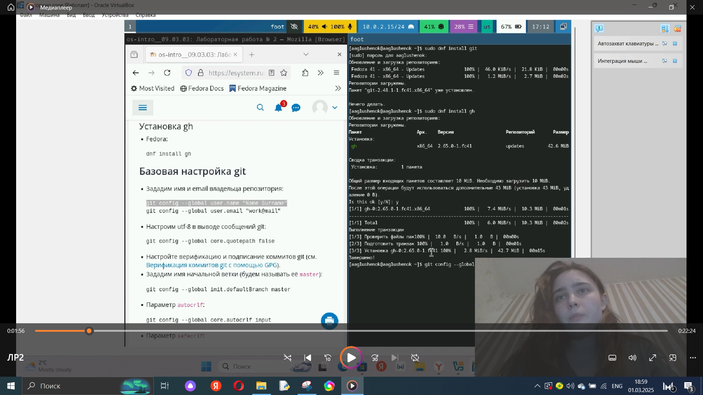{#fig:001 width=40%}

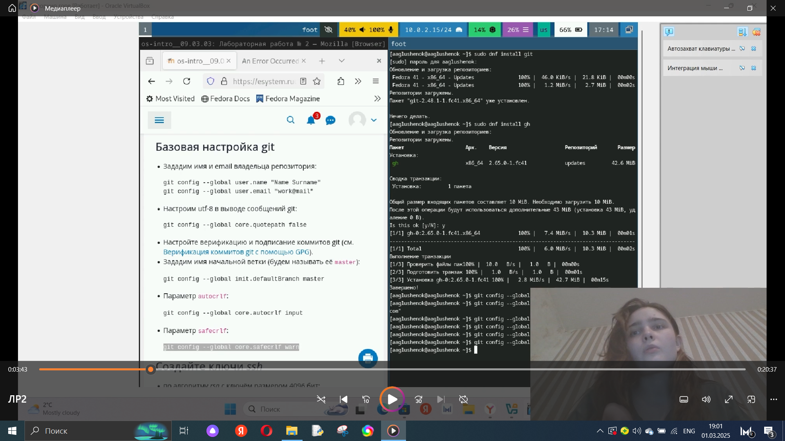{#fig:002 width=40%}

## Создание ключей SSH

ключ SSH по алгоритму rsa, по алгоритму ed25519: 

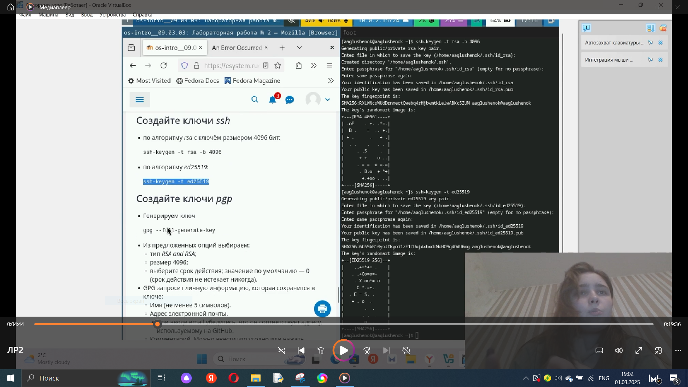{#fig:003 width=60%}

## Создание ключа PGP 

генерация ключа pgp

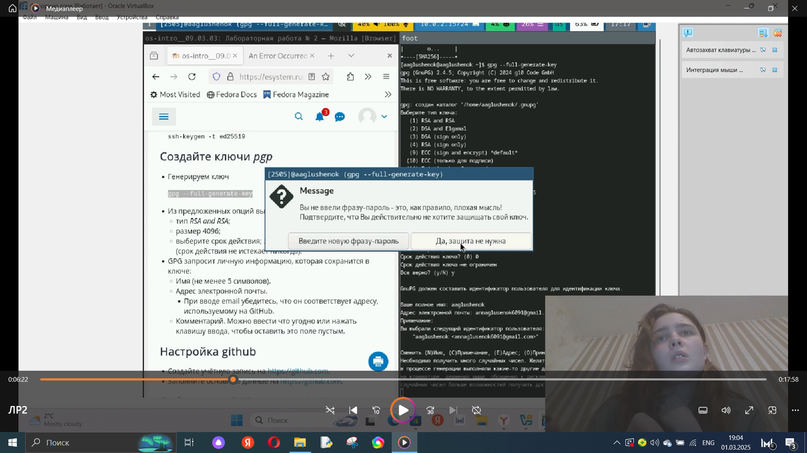{#fig:004 width=60%}

## Добавление PGP ключа в GitHub
вывод  список ключей, копирование отпечатка, копирование ключа в буфер обмена, вставка в поле ввода: 

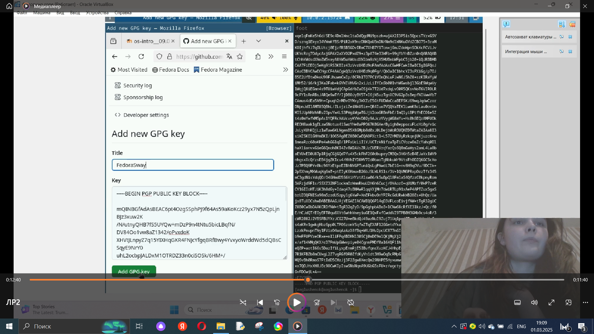{#fig:005 width=25%}

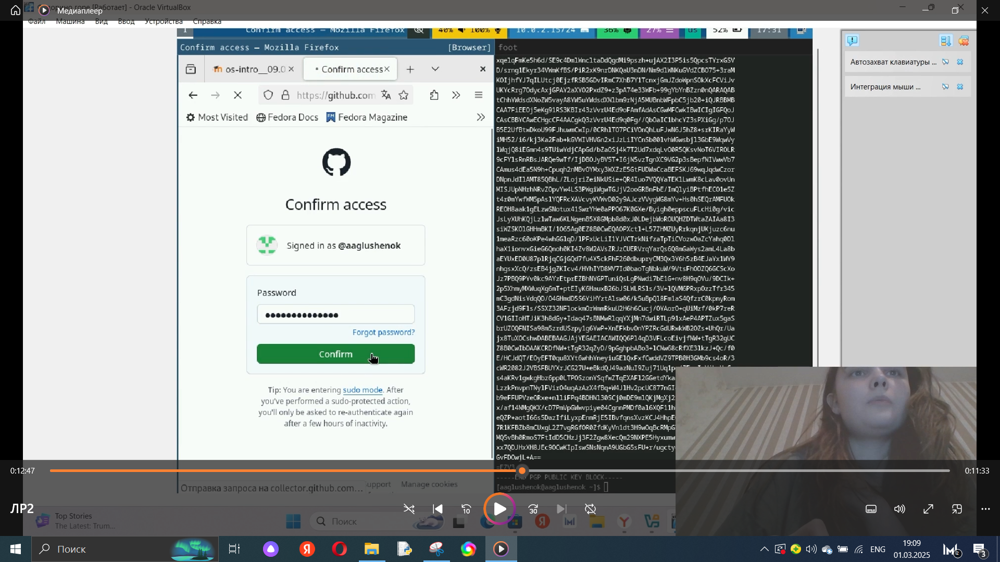{#fig:006 width=25%}

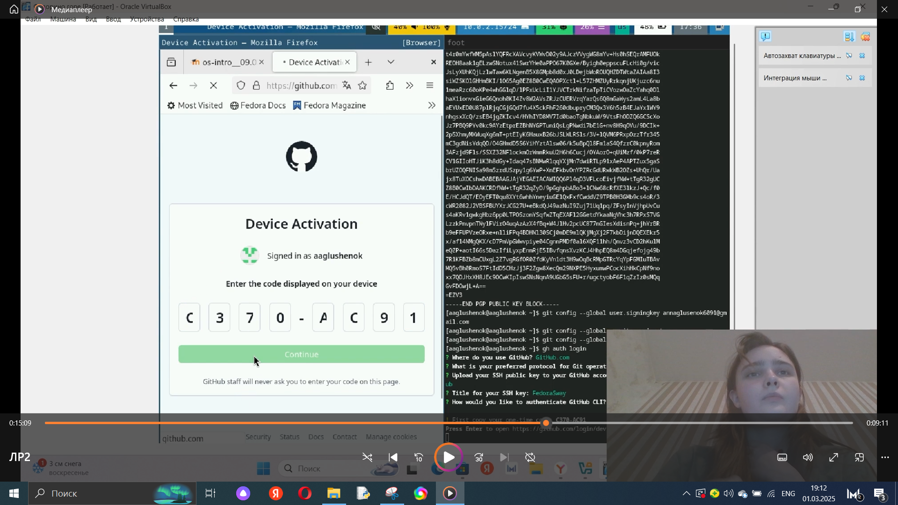{#fig:007 width=25%}

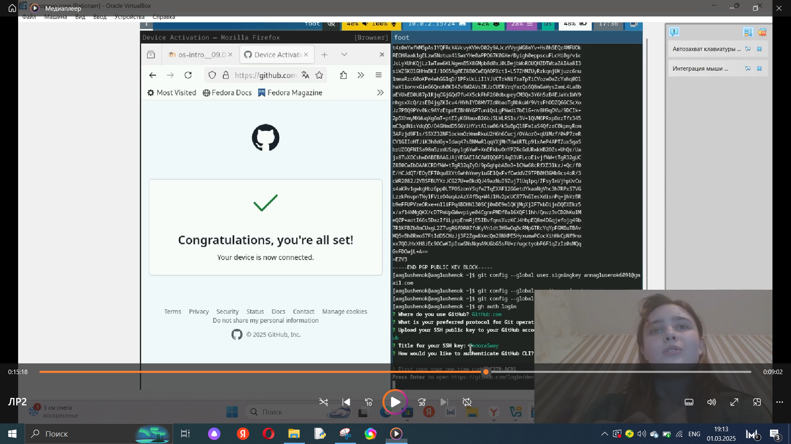{#fig:008 width=25%}

## Настройка автоматических подписей коммитов git

указание Git применять введёный email при подписи коммитов, настройка gh 

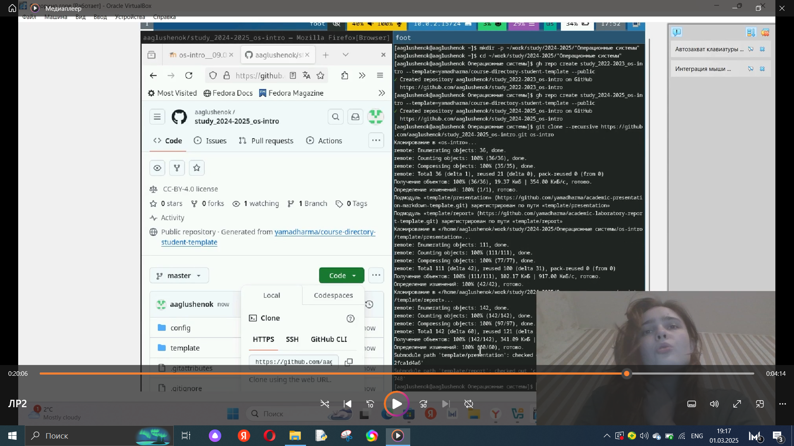{#fig:009 width=60%}

## Сознание репозитория курса, настройка каталога

Создание репозитория курса, настройка каталога курса - удаление лишних файлов, создадание необходимых каталогов:

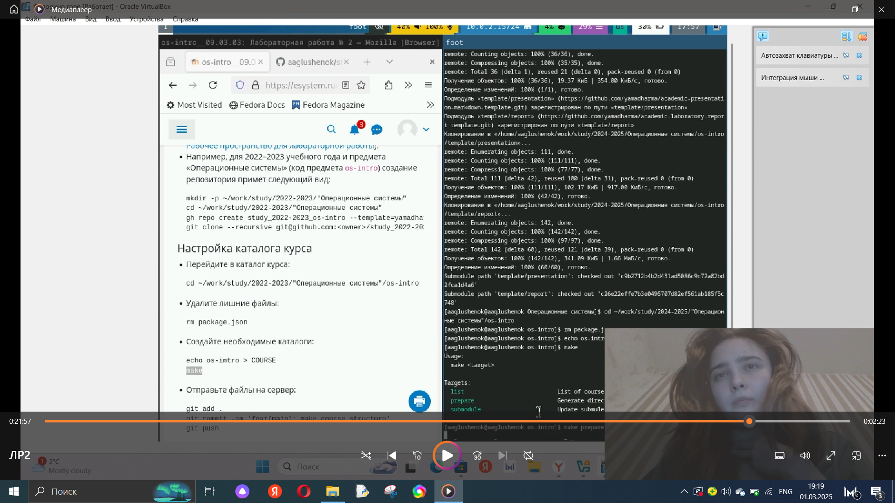{#fig:010 width=40%}

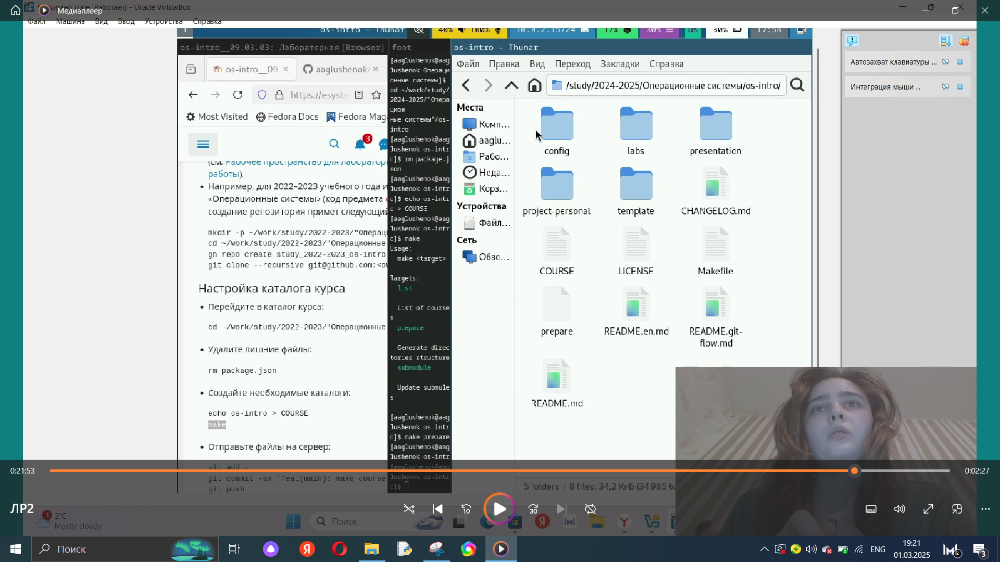{#fig:011 width=40%}

## Отправка файлов на сервер

Отправка файлов

{#fig:012 width=80%}

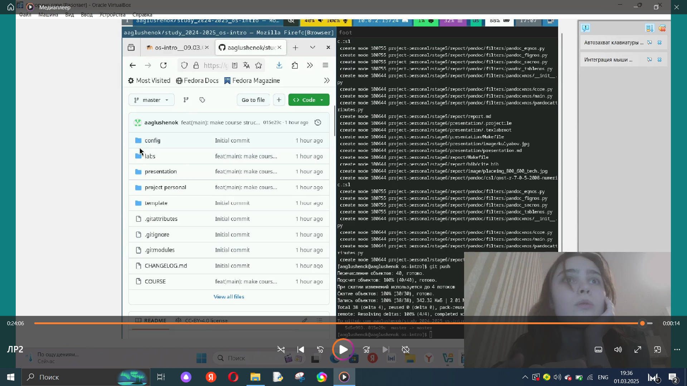{#fig:013 width=80%}

## Выводы

В ходе выполнения лабораторной работы №2 мне удалось изучить идеологию и применение средств контроля версий, а так же освоить умения по работе с git.

## Благодарю за внимание!
