---
## Front matter
title: "Лабораторная работа № 2. Первоначальна настройка git."
subtitle: "Отчет"
author: "Анна Александровна Глушенок"

## Generic otions
lang: ru-RU
toc-title: "Содержание"

## Bibliography
bibliography: bib/cite.bib
csl: pandoc/csl/gost-r-7-0-5-2008-numeric.csl

## Pdf output format
toc: true # Table of contents
toc-depth: 2
lof: true # List of figures
lot: true # List of tables
fontsize: 12pt
linestretch: 1.5
papersize: a4
documentclass: scrreprt
## I18n polyglossia
polyglossia-lang:
  name: russian
  options:
	- spelling=modern
	- babelshorthands=true
polyglossia-otherlangs:
  name: english
## I18n babel
babel-lang: russian
babel-otherlangs: english
## Fonts
mainfont: IBM Plex Serif
romanfont: IBM Plex Serif
sansfont: IBM Plex Sans
monofont: IBM Plex Mono
mathfont: STIX Two Math
mainfontoptions: Ligatures=Common,Ligatures=TeX,Scale=0.94
romanfontoptions: Ligatures=Common,Ligatures=TeX,Scale=0.94
sansfontoptions: Ligatures=Common,Ligatures=TeX,Scale=MatchLowercase,Scale=0.94
monofontoptions: Scale=MatchLowercase,Scale=0.94,FakeStretch=0.9
mathfontoptions:
## Biblatex
biblatex: true
biblio-style: "gost-numeric"
biblatexoptions:
  - parentracker=true
  - backend=biber
  - hyperref=auto
  - language=auto
  - autolang=other*
  - citestyle=gost-numeric
## Pandoc-crossref LaTeX customization
figureTitle: "Рис."
tableTitle: "Таблица"
listingTitle: "Листинг"
lofTitle: "Список иллюстраций"
lotTitle: "Список таблиц"
lolTitle: "Листинги"
## Misc options
indent: true
header-includes:
  - \usepackage{indentfirst}
  - \usepackage{float} # keep figures where there are in the text
  - \floatplacement{figure}{H} # keep figures where there are in the text
---

# Цель работы

1. Изучить идеологию и применение средств контроля версий.
2. Освоить умения по работе с git.

# Задание

1. Создать базовую конфигурацию для работы с git.
2. Создать ключ SSH.
3. Создать ключ PGP.
4. Настроить подписи git.
5. Зарегистрироваться на Github.
6. Создать локальный каталог для выполнения заданий по предмету.

# Выполнение лабораторной работы

Установим git, gh: 

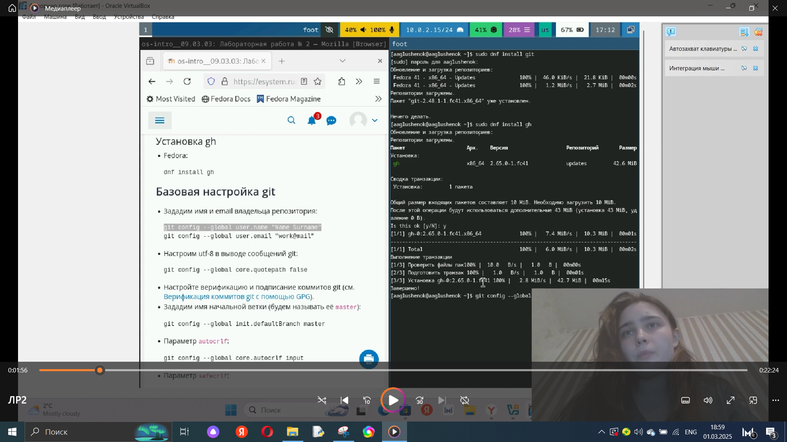{#fig:001 width=80%}

Зададим имя и email владельца репозитория; Настроим utf-8 в выводе сообщений git; Зададим имя начальной ветки; Настроим параметры autocrlf и safecrlf:

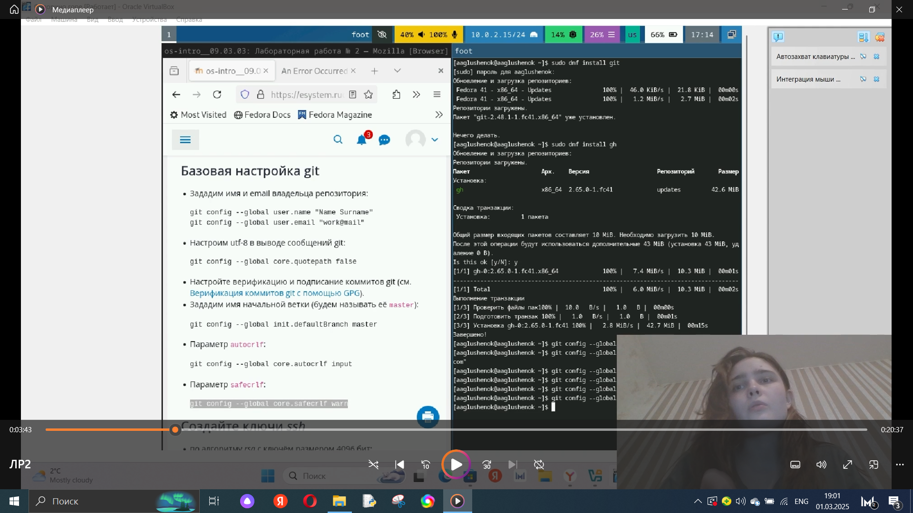{#fig:002 width=80%}

Создадим ключ SSH по алгоритму rsa с ключём размером 4096 бит; по алгоритму ed25519: 

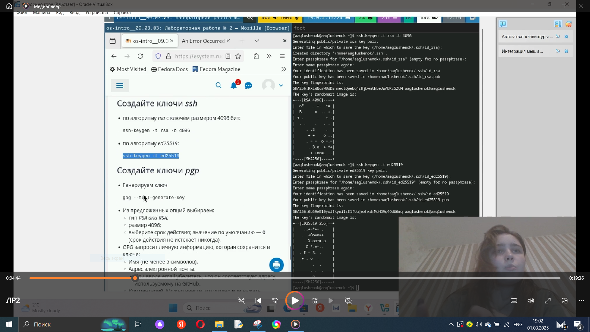{#fig:003 width=80%}

Сгенерируем ключ pgp в соответствии с указанными опциями:

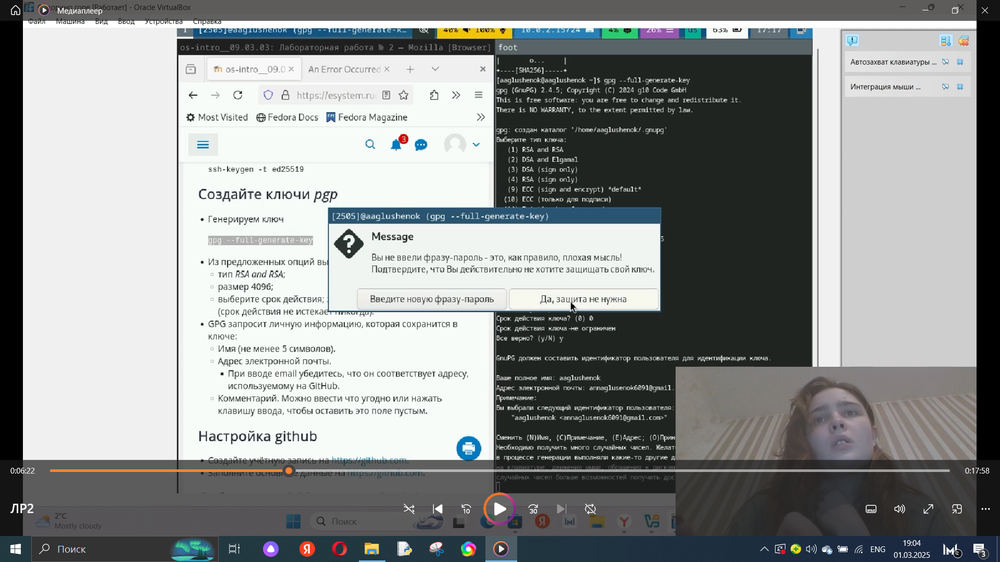{#fig:004 width=80%}

Выведем список ключей и скопируем отпечаток приватного ключа;Cкопируем сгенерированный PGP ключ в буфер обмена; Перейдем в настройки GitHub, вставим полученный ключ в поле ввода: 

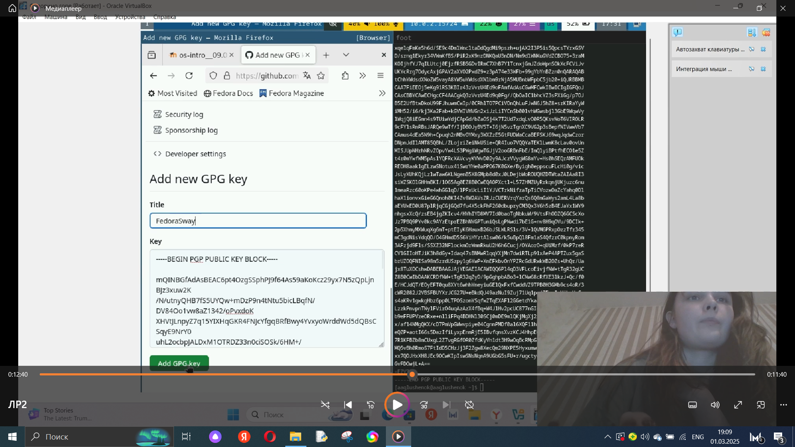{#fig:005 width=80%}

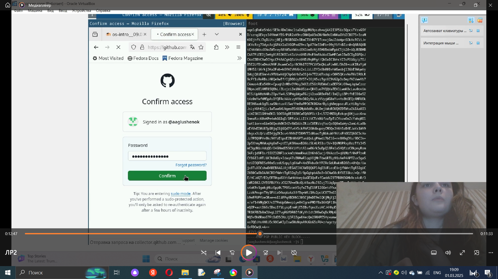{#fig:006 width=80%}

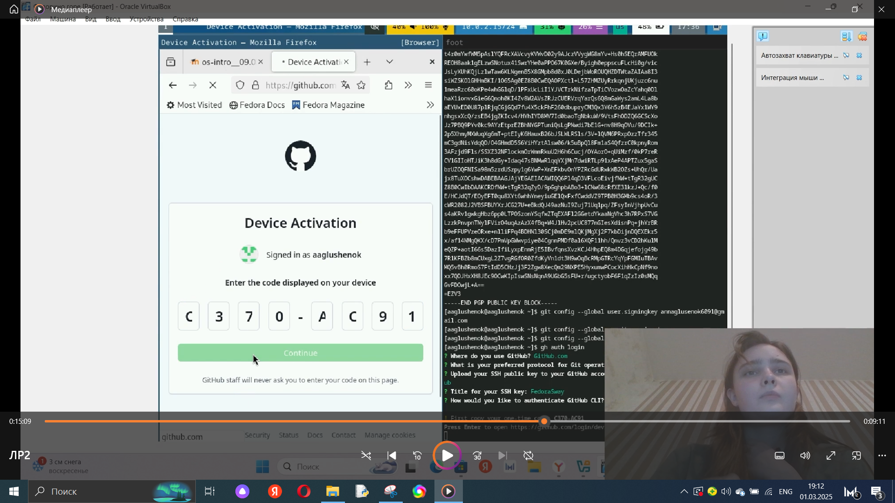{#fig:007 width=80%}

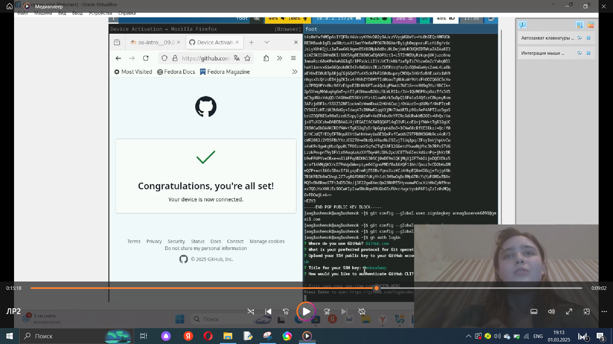{#fig:008 width=80%}

Используя введёный email, укажем Git применять его при подписи коммитов. Настроим gh - авторизируемся: 

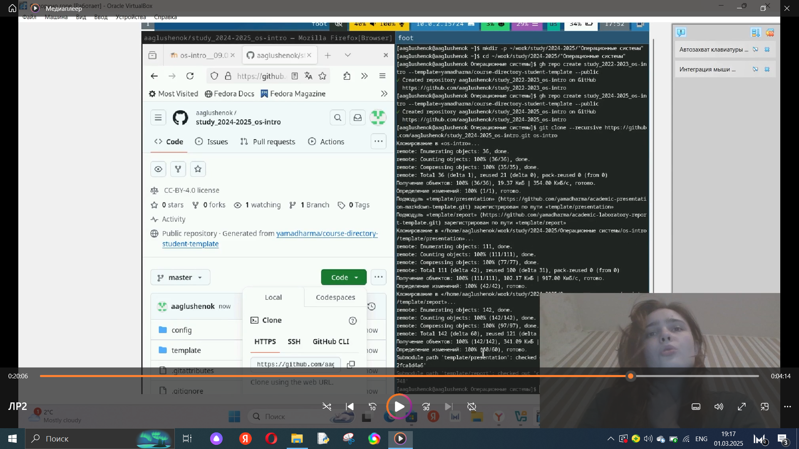{#fig:009 width=80%}

Создадим рабочее пространство на основе шаблона. Настроим каталог курса - удалим лишние файлы, создадим необходимые каталоги:

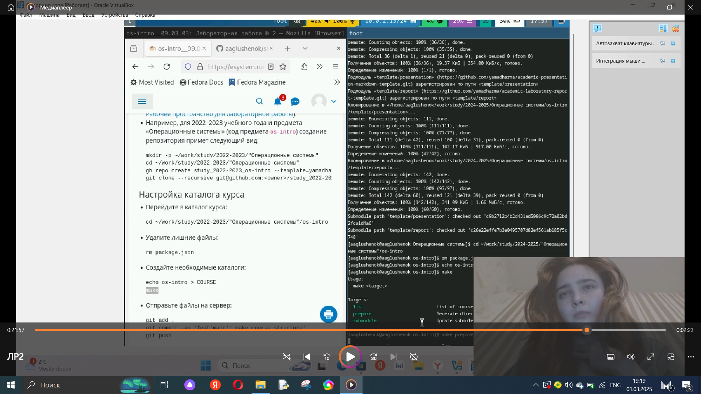{#fig:010 width=80%}

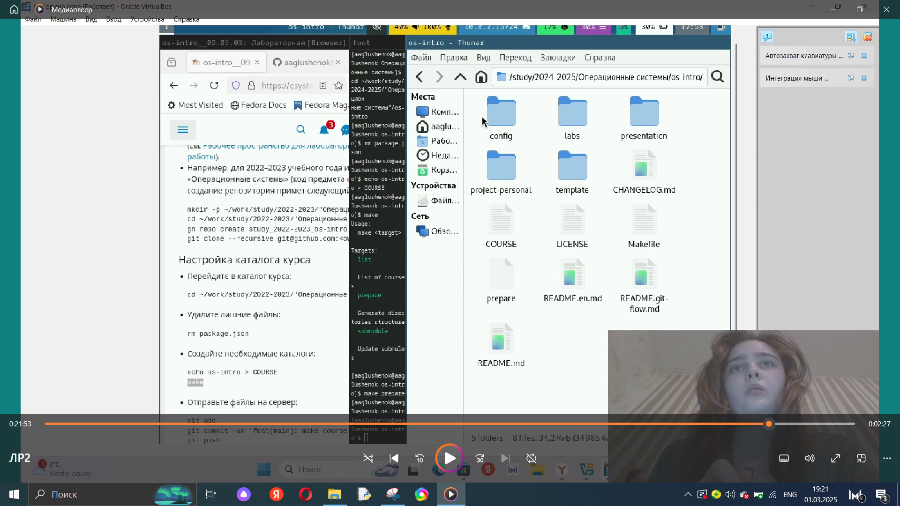{#fig:011 width=80%}

Отправим файлы на сервер: 

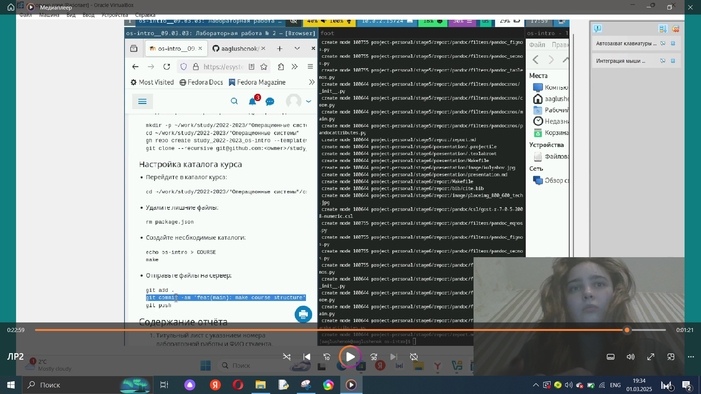{#fig:012 width=80%}

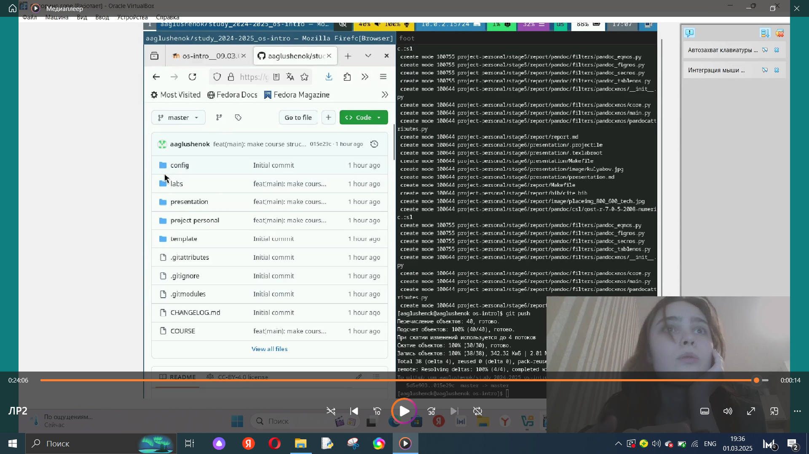{#fig:013 width=80%}

# Выводы

В ходе выполнения лабораторной работы №2 мне удалось изучить идеологию и применение средств контроля версий, а так же освоить умения по работе с git.

# Список литературы{.unnumbered}

::: {#refs}
:::
