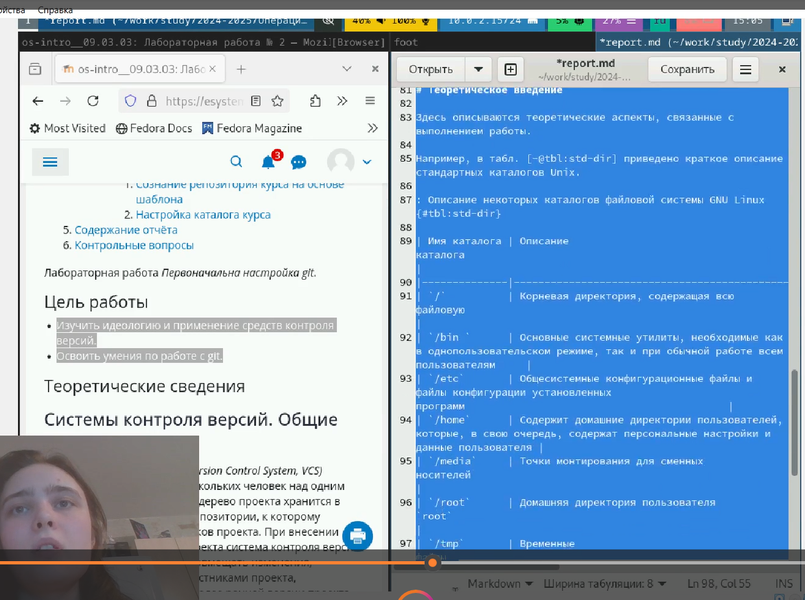
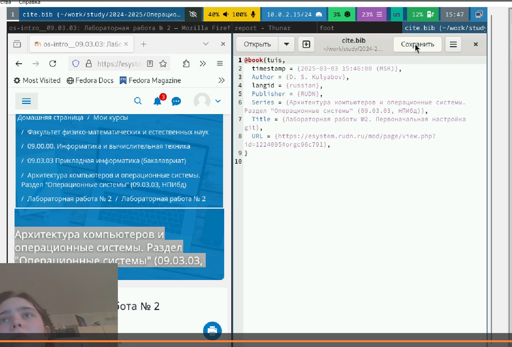

---
## Front matter
lang: ru-RU
title: Лабораторная работы №3. Настройка прав доступа.\.
subtitle: Презентация
author:
  - Глушенок А. А.
institute:
  - Российский университет дружбы народов, Москва, Россия
date: 06 сентября 2025

## i18n babel
babel-lang: russian
babel-otherlangs: english

## Formatting pdf
toc: false
toc-title: Содержание
slide_level: 2
aspectratio: 169
section-titles: true
theme: metropolis
header-includes:
 - \metroset{progressbar=frametitle,sectionpage=progressbar,numbering=fraction}
 
## Fonts
mainfont: PT Serif
romanfont: PT Serif
sansfont: PT Sans
monofont: PT Mono
mainfontoptions: Ligatures=TeX
romanfontoptions: Ligatures=TeX
sansfontoptions: Ligatures=TeX,Scale=MatchLowercase
monofontoptions: Scale=MatchLowercase,Scale=0.9
---

## Докладчик

:::::::::::::: {.columns align=center}
::: {.column width="70%"}

  * Глушенок Анна Александровна
  * Студент НПИбд-01-24
  * Факультет физико-математических и естественных наук
  * Российский университет дружбы народов
  * [1132246844@pfur.ru](mailto:1132246844@pfur.ru)
  * <https://github.com/aaglushenok>

:::
::: {.column width="30%"}

:::
::::::::::::::

## Цель работы

Получение навыков настройки базовых и специальных прав доступа для групп пользователей в операционной системе типа Linux.

## Управление базовыми разрешениями.

1. Откройте терминал с учётной записью root.
2. В корневом каталоге создайте каталоги /data/main и /data/third. Посмотрите, кто является владельцем этих каталогов.

{#fig:001 width=40%}

Владелец: root.

## Управление базовыми разрешениями.

3. Прежде чем устанавливать разрешения, измените владельцев этих каталогов с root на main и third соответственно. Посмотрите, кто теперь является владельцем этих каталогов.

{#fig:002 width=40%}

Владельцы: 1 - main, 2 - third.

## Управление базовыми разрешениями.

4. Установите разрешения, позволяющие владельцам каталогов записывать файлы в эти каталоги и запрещающие доступ к содержимому каталогов всем другим пользователям и группам. Проверьте установленные права доступа.

{#fig:003 width=40%}

## Управление базовыми разрешениями.

5. В другом терминале перейдите под учётную запись пользователя bob.
6. Под пользователем bob попробуйте перейти в каталог /data/main и создать файл emptyfile в этом каталоге. Выведите разрешения. Опишите и поясните результат этого действия.

{#fig:004 width=40%}

Пользователь иммет права на чтение и запись, остальные только на чтение.

## Управление базовыми разрешениями.

7. Под пользователем bob попробуйте перейти в каталог /data/third и создать файл emptyfile в этом каталоге. Опишите и поясните результат этого действия.

{#fig:005 width=40%}

Результат: отказано в доступе, тк bob принадлежит группе main, а не third.

## Управление специальными разрешениями.

1. Откройте новый терминал под пользователем alice.
2. Перейдите в каталог /data/main. Создайте два файла, владельцем которых является alice.

{#fig:006 width=40%}

## Управление специальными разрешениями.

3. В другом терминале перейдите под учётную запись пользователя bob (пользователь bob является членом группы main, как и alice).
4. Перейдите в каталог /data/main, и в этом каталоге введите ls -l. Вы увидите два файла, созданные пользователем alice. Попробуйте удалить файлы, принадлежащие пользователю alice. Убедитесь, что файлы будут удалены пользователем bob.

{#fig:007 width=40%}

Результат: файлы удалены.

## Управление специальными разрешениями.

5. Создайте два файла, которые принадлежат пользователю bob.

{#fig:008 width=40%}

## Управление специальными разрешениями.

6. В терминале под пользователем root установите для каталога /data/main бит идентификатора группы, а также stiky-бит для разделяемого (общего) каталога группы.

{#fig:009 width=40%}

## Управление специальными разрешениями.

7. В терминале под пользователем alice создайте в каталоге /data/main файлы alice3 и alice4. Выведите права дсотупа.Теперь вы должны увидеть, что два созданных вами файла принадлежат группе main, которая является группой-владельцем каталога /data/main.

{#fig:010 width=40%}

Результат: файлы alice1 и alice2 принадлежат группе main.

## Управление специальными разрешениями.

8. В терминале под пользователем alice попробуйте удалить файлы, принадлежащие пользователю bob.

{#fig:011 width=40%}

Результат: отказано в доступе, тк их владелец - bob.

## Управление расширенными разрешениями с использованием списков ACL.

1. Откройте терминал с учётной записью root.
2. Установите права на чтение и выполнение в каталоге /data/main для группы third и права на чтение и выполнение для группы main в каталоге /data/third.
3. Используйте команду getfacl, чтобы убедиться в правильности установки разрешений.

{#fig:012 width=30%}

Результат: мы установили права на чтение и выполнение. При проверке видим, что права установлены верно.

## Управление расширенными разрешениями с использованием списков ACL.

4. Создайте новый файл с именем newfile1 в каталоге /data/main. Используйте
getfacl /data/main/newfile1 для проверки текущих назначений полномочий. Какие права доступа у этого файла? Объясните, почему. Выполните аналогичные действия для каталога /data/third. Дайте пояснения.

{#fig:013 width=30%}

Результат: права для обоих файлов одинаковы: для пользователя это чтение и запись, для групп и других - только чтение. Разница в принадлежности в группам: для первого файла это main, для второго - root.

## Управление расширенными разрешениями с использованием списков ACL.

5. Установите ACL по умолчанию для каталога /data/main.
6. Добавьте ACL по умолчанию для каталога /data/third.

{#fig:014 width=40%}

## Управление расширенными разрешениями с использованием списков ACL.

7. Убедитесь, что настройки ACL работают, добавив новый файл в каталог /data/main. Используйте getfacl /data/main/newfile2 для проверки текущих назначений полномочий. Выполните аналогичные действия для каталога /data/third.

{#fig:015 width=30%}

Результат: права на чтение, запись и выполнение. (1 - group:third, 2 - group:main). 

## Управление расширенными разрешениями с использованием списков ACL.

8. Для проверки полномочий группы third в каталоге /data/third войдите в другом терминале под учётной записью члена группы third. Проверьте операции с файлами: rm /data/main/newfile1, rm /data/main/newfile2. Проверьте, возможно ли осуществить запись в файл: echo "Hello, world" >> /data/main/newfile1, echo "Hello, world" >> /data/main/newfile2.

{#fig:016 width=40%}

Результат: отказ в доступе при попытке удаления файлов, тк carol не в группе main. Отказ в доступе при попытке при попытк записи в файл newfile, и успешная запись в newfile2, тк он создан уже после изменения настроек.

## Выводы

В ходе выполнения лабораторной работы №3 мне удалось получить навыки настройки базовых и специальных прав доступа для групп пользователей в операционной системе типа Linux.

## Благодарю за внимание!
