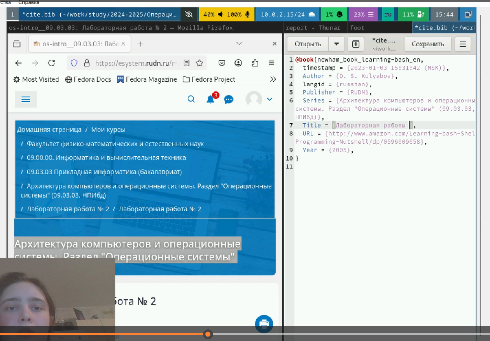

---
## Front matter
lang: ru-RU
title: Лабораторная работы №3. Markdown.
subtitle: Презентация
author:
  - Глушенок А. А.
institute:
  - Российский университет дружбы народов, Москва, Россия
date: 06 марта 2025

## i18n babel
babel-lang: russian
babel-otherlangs: english

## Formatting pdf
toc: false
toc-title: Содержание
slide_level: 2
aspectratio: 169
section-titles: true
theme: metropolis
header-includes:
 - \metroset{progressbar=frametitle,sectionpage=progressbar,numbering=fraction}
 
## Fonts
mainfont: PT Serif
romanfont: PT Serif
sansfont: PT Sans
monofont: PT Mono
mainfontoptions: Ligatures=TeX
romanfontoptions: Ligatures=TeX
sansfontoptions: Ligatures=TeX,Scale=MatchLowercase
monofontoptions: Scale=MatchLowercase,Scale=0.9
---

## Докладчик

:::::::::::::: {.columns align=center}
::: {.column width="70%"}

  * Глушенок Анна Александровна
  * Студент НПИбд-01-24
  * Факультет физико-математических и естественных наук
  * Российский университет дружбы народов
  * [1132246844@pfur.ru](mailto:1132246844@pfur.ru)
  * <https://github.com/aaglushenok/study_2024-2025_arh-pc>

:::
::: {.column width="30%"}

:::
::::::::::::::

## Цель 

Научиться оформлять отчёты с помощью легковесного языка разметки Markdown.

## Задание

1. Сделать отчёт по предыдущей лабораторной работе в формате Markdown.
2. В качестве отчёта предоставить отчёты в 3 форматах: pdf, docx и md (в архиве, поскольку он должен содержать скриншоты, Makefile и т.д.)

# Front Matter

заголовок, подзаголовок и ФИО автора 

{#fig:001 width=60%}

## Разделы "Цель", "Теоретическое введение"

Заполнение раздела "Цель" - копирование из материалов; удаление раздела "Теоретическое введение" - предназначен только для изучения

{#fig:002 width=40%}

{#fig:003 width=40%}

## Разделы "Вывод", "Задания"

Заполнение раздела "Вывод" - сформулируем исходя из цели. Заполнение раздела "Задания" - копируем из материалов

{#fig:004 width=40%}

{#fig:005 width=40%}

## Раздел "Выполнение лабораторной работы" (1)

Начнем заполнение. Прописываем действия и комнады из материалов, вставляем подтверждающий успешное выполнение скриншот, ссылку на рисунок

{#fig:006 width=60%}

## Раздел "Выполнение лабораторной работы" (2)

Следующие блоки заполняем по аналогии с предыдущим пунктом - прописываем действия и комнады, вставляем скриншот и ссылку на рисунок. Повторяем до момента окончания разделов

{#fig:007 width=40%}

{#fig:008 width=40%}

## Раздел "Список литературы"

Заполним "Список литературы" - откроем файл с расширением .bib, удалим бОльшую часть текста, оставив последний абзац. Заполним время захода, автора, язык, издательство, серию, заголовок, вставим ссылку на источник, удалим лишние строки:

{#fig:009 width=40%}

{#fig:010 width=40%}

## Завершение работы

Сохраним изменения в файле .bib, конвертируем отчет в другие форматы. Выполнение отчета к работе можно будет считать завершенным:

{#fig:011 width=60%}

## Выводы

В ходе выполнения лабораторной работы №3 мне удалось научиться оформлять отчёты с помощью легковесного языка разметки Markdown.

## Благодарю за внимание!
