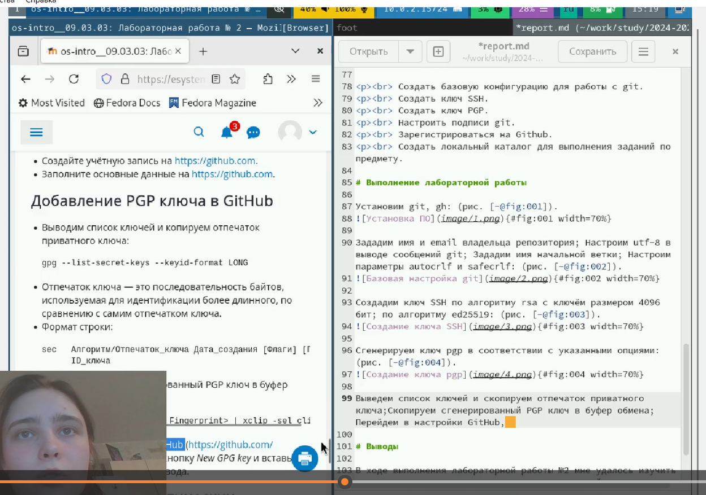
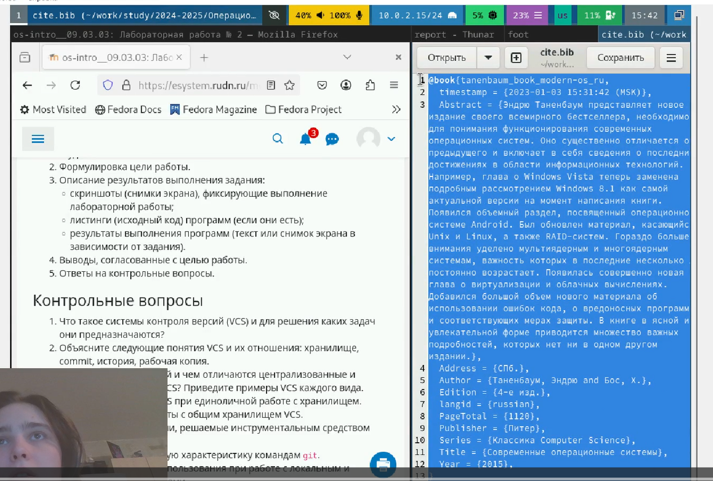

---
## Front matter
title: "Лабораторная работа №3. Настройка прав доступа."
subtitle: "Отчет"
author: "Анна Александровна Глушенок"

## Generic otions
lang: ru-RU
toc-title: "Содержание"

## Bibliography
bibliography: bib/cite.bib
csl: pandoc/csl/gost-r-7-0-5-2008-numeric.csl

## Pdf output format
toc: true # Table of contents
toc-depth: 2
lof: true # List of figures
lot: true # List of tables
fontsize: 12pt
linestretch: 1.5
papersize: a4
documentclass: scrreprt
## I18n polyglossia
polyglossia-lang:
  name: russian
  options:
	- spelling=modern
	- babelshorthands=true
polyglossia-otherlangs:
  name: english
## I18n babel
babel-lang: russian
babel-otherlangs: english
## Fonts
mainfont: IBM Plex Serif
romanfont: IBM Plex Serif
sansfont: IBM Plex Sans
monofont: IBM Plex Mono
mathfont: STIX Two Math
mainfontoptions: Ligatures=Common,Ligatures=TeX,Scale=0.94
romanfontoptions: Ligatures=Common,Ligatures=TeX,Scale=0.94
sansfontoptions: Ligatures=Common,Ligatures=TeX,Scale=MatchLowercase,Scale=0.94
monofontoptions: Scale=MatchLowercase,Scale=0.94,FakeStretch=0.9
mathfontoptions:
## Biblatex
biblatex: true
biblio-style: "gost-numeric"
biblatexoptions:
  - parentracker=true
  - backend=biber
  - hyperref=auto
  - language=auto
  - autolang=other*
  - citestyle=gost-numeric
## Pandoc-crossref LaTeX customization
figureTitle: "Рис."
tableTitle: "Таблица"
listingTitle: "Листинг"
lofTitle: "Список иллюстраций"
lotTitle: "Список таблиц"
lolTitle: "Листинги"
## Misc options
indent: true
header-includes:
  - \usepackage{indentfirst}
  - \usepackage{float} # keep figures where there are in the text
  - \floatplacement{figure}{H} # keep figures where there are in the text
---

# Цель работы

Получение навыков настройки базовых и специальных прав доступа для групп пользователей в операционной системе типа Linux.

# Выполнение лабораторной работы

## Управление базовыми разрешениями.

1. Откройте терминал с учётной записью root.
2. В корневом каталоге создайте каталоги /data/main и /data/third. Посмотрите, кто является владельцем этих каталогов.

{#fig:001 width=80%}

Владелец: root.

3. Прежде чем устанавливать разрешения, измените владельцев этих каталогов с root на main и third соответственно. Посмотрите, кто теперь является владельцем этих каталогов.

{#fig:002 width=80%}

Владельцы: 1 - main, 2 - third.

4. Установите разрешения, позволяющие владельцам каталогов записывать файлы в эти каталоги и запрещающие доступ к содержимому каталогов всем другим пользователям и группам. Проверьте установленные права доступа.

{#fig:003 width=80%}

5. В другом терминале перейдите под учётную запись пользователя bob.
6. Под пользователем bob попробуйте перейти в каталог /data/main и создать файл emptyfile в этом каталоге. Выведите разрешения. Опишите и поясните результат этого действия.

{#fig:004 width=80%}

Пользователь иммет права на чтение и запись, остальные только на чтение.

7. Под пользователем bob попробуйте перейти в каталог /data/third и создать файл emptyfile в этом каталоге. Опишите и поясните результат этого действия.

{#fig:005 width=80%}

Результат: отказано в доступе, тк bob принадлежит группе main, а не third.

## Управление специальными разрешениями.

1. Откройте новый терминал под пользователем alice.
2. Перейдите в каталог /data/main. Создайте два файла, владельцем которых является alice.

{#fig:006 width=80%}

3. В другом терминале перейдите под учётную запись пользователя bob (пользователь bob является членом группы main, как и alice).
4. Перейдите в каталог /data/main, и в этом каталоге введите ls -l. Вы увидите два файла, созданные пользователем alice. Попробуйте удалить файлы, принадлежащие пользователю alice. Убедитесь, что файлы будут удалены пользователем bob.

{#fig:007 width=80%}

Результат: файлы удалены.

5. Создайте два файла, которые принадлежат пользователю bob.

{#fig:008 width=80%}

6. В терминале под пользователем root установите для каталога /data/main бит идентификатора группы, а также stiky-бит для разделяемого (общего) каталога группы.

{#fig:009 width=80%}

7. В терминале под пользователем alice создайте в каталоге /data/main файлы alice3 и alice4. Выведите права дсотупа.Теперь вы должны увидеть, что два созданных вами файла принадлежат группе main, которая является группой-владельцем каталога /data/main.

{#fig:010 width=80%}

Результат: файлы alice1 и alice2 принадлежат группе main.

8. В терминале под пользователем alice попробуйте удалить файлы, принадлежащие пользователю bob.

{#fig:011 width=80%}

Результат: отказано в доступе, тк их владелец - bob.

## Управление расширенными разрешениями с использованием списков ACL.

1. Откройте терминал с учётной записью root.
2. Установите права на чтение и выполнение в каталоге /data/main для группы third и права на чтение и выполнение для группы main в каталоге /data/third.
3. Используйте команду getfacl, чтобы убедиться в правильности установки разрешений.

{#fig:012 width=80%}

Результат: мы установили права на чтение и выполнение. При проверке видим, что права установлены верно.

4. Создайте новый файл с именем newfile1 в каталоге /data/main. Используйте
getfacl /data/main/newfile1 для проверки текущих назначений полномочий. Какие права доступа у этого файла? Объясните, почему. Выполните аналогичные действия для каталога /data/third. Дайте пояснения.

{#fig:013 width=80%}

Результат: права для обоих файлов одинаковы: для пользователя это чтение и запись, для групп и других - только чтение. Разница в принадлежности в группам: для первого файла это main, для второго - root.

5. Установите ACL по умолчанию для каталога /data/main.
6. Добавьте ACL по умолчанию для каталога /data/third.

{#fig:014 width=80%}

7. Убедитесь, что настройки ACL работают, добавив новый файл в каталог /data/main. Используйте getfacl /data/main/newfile2 для проверки текущих назначений полномочий. Выполните аналогичные действия для каталога /data/third.

{#fig:015 width=80%}

Результат: права на чтение, запись и выполнение. (1 - group:third, 2 - group:main). 

8. Для проверки полномочий группы third в каталоге /data/third войдите в другом терминале под учётной записью члена группы third. Проверьте операции с файлами: rm /data/main/newfile1, rm /data/main/newfile2. Проверьте, возможно ли осуществить запись в файл: echo "Hello, world" >> /data/main/newfile1, echo "Hello, world" >> /data/main/newfile2. Объясните результат произведённых действий.

{#fig:016 width=80%}

Результат: отказ в доступе при попытке удаления файлов, тк carol не в группе main. Отказ в доступе при попытке при попытк записи в файл newfile, и успешная запись в newfile2, тк он создан уже после изменения настроек.

# Контрольные вопросы

1. Как следует использовать команду chown, чтобы установить владельца группы для файла?
Команда: chown :группа файл
Пример: chown :developers script.sh

2. С помощью какой команды можно найти все файлы, принадлежащие конкретному пользователю?
Команда: find / -user имя_пользователя
Пример: find /home -user ivan

3. Как применить разрешения на чтение, запись и выполнение для всех файлов в каталоге /data для пользователей и владельцев групп, не устанавливая никаких прав для других?
Команда: chmod -R ug=rwx,o= /data

4. Какая команда позволяет добавить разрешение на выполнение для файла, который необходимо сделать исполняемым?
Команда: chmod +x файл
Пример: chmod +x my_script

5. Какая команда позволяет убедиться, что групповые разрешения для всех новых файлов, создаваемых в каталоге, будут присвоены владельцу группы этого каталога?
Команда: chmod g+s каталог
Пример: chmod g+s /shared_data

6. Необходимо, чтобы пользователи могли удалять только те файлы, владельцами которых они являются. С помощью какой команды можно это сделать?
Команда: chmod +t каталог
Пример: chmod +t /shared_uploads (это устанавливает sticky bit)

7. Какая команда добавляет ACL, который предоставляет членам группы права доступа на чтение для всех существующих файлов в текущем каталоге?
Команда: setfacl -R -m g:группа:r *
Пример: setfacl -R -m g:accounting:r *

8. Что нужно сделать для гарантии того, что члены группы получат разрешения на чтение для всех файлов в текущем каталоге и во всех его подкаталогах, а также для всех файлов, которые будут созданы в будущем?
Нужно установить ACL с рекурсией (-R) и default-правилом (-d).
Пример: setfacl -R -d -m g:mygroup:rX .

9. Какое значение umask нужно установить, чтобы «другие» пользователи не получали какие-либо разрешения на новые файлы?
Значение: umask 007
Пример: umask 007; touch newfile.txt (права для others будут ---)

10. Какая команда гарантирует, что никто не сможет удалить файл myfile случайно?
Команда: chattr +i myfile (устанавливает атрибут "неизменяемость")

# Выводы

В ходе выполнения лабораторной работы №3 мне удалось получить навыки настройки базовых и специальных прав доступа для групп пользователей в операционной системе типа Linux.

# Список литературы{.unnumbered}

::: {#refs}
:::
