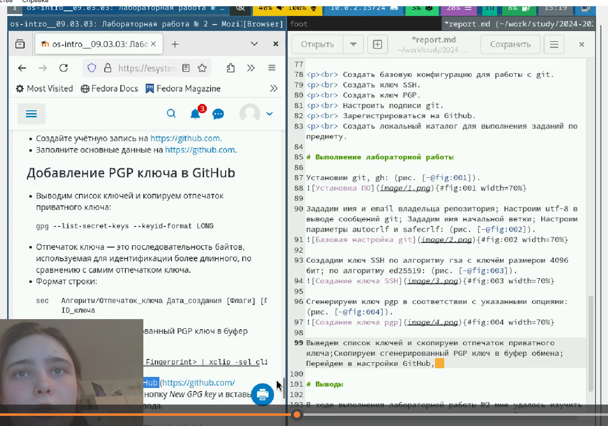

---
## Front matter
title: "Лабораторная работа № 3. Markdown."
subtitle: "Отчет"
author: "Анна Александровна Глушенок"

## Generic otions
lang: ru-RU
toc-title: "Содержание"

## Bibliography
bibliography: bib/cite.bib
csl: pandoc/csl/gost-r-7-0-5-2008-numeric.csl

## Pdf output format
toc: true # Table of contents
toc-depth: 2
lof: true # List of figures
lot: true # List of tables
fontsize: 12pt
linestretch: 1.5
papersize: a4
documentclass: scrreprt
## I18n polyglossia
polyglossia-lang:
  name: russian
  options:
	- spelling=modern
	- babelshorthands=true
polyglossia-otherlangs:
  name: english
## I18n babel
babel-lang: russian
babel-otherlangs: english
## Fonts
mainfont: IBM Plex Serif
romanfont: IBM Plex Serif
sansfont: IBM Plex Sans
monofont: IBM Plex Mono
mathfont: STIX Two Math
mainfontoptions: Ligatures=Common,Ligatures=TeX,Scale=0.94
romanfontoptions: Ligatures=Common,Ligatures=TeX,Scale=0.94
sansfontoptions: Ligatures=Common,Ligatures=TeX,Scale=MatchLowercase,Scale=0.94
monofontoptions: Scale=MatchLowercase,Scale=0.94,FakeStretch=0.9
mathfontoptions:
## Biblatex
biblatex: true
biblio-style: "gost-numeric"
biblatexoptions:
  - parentracker=true
  - backend=biber
  - hyperref=auto
  - language=auto
  - autolang=other*
  - citestyle=gost-numeric
## Pandoc-crossref LaTeX customization
figureTitle: "Рис."
tableTitle: "Таблица"
listingTitle: "Листинг"
lofTitle: "Список иллюстраций"
lotTitle: "Список таблиц"
lolTitle: "Листинги"
## Misc options
indent: true
header-includes:
  - \usepackage{indentfirst}
  - \usepackage{float} # keep figures where there are in the text
  - \floatplacement{figure}{H} # keep figures where there are in the text
---

# Цель работы

Научиться оформлять отчёты с помощью легковесного языка разметки Markdown.

# Задание

1. Сделать отчёт по предыдущей лабораторной работе в формате Markdown.
2. В качестве отчёта предоставить отчёты в 3 форматах: pdf, docx и md (в архиве, поскольку он должен содержать скриншоты, Makefile и т.д.)

# Выполнение лабораторной работы

Заполним раздел "Front Matter" - введем заголовок, подзаголовок и ФИО автора работы:

{#fig:001 width=80%}

Заполним раздел "Цель лобораторной работы" - копируем ее из материалов к лабораторной работе:

{#fig:002 width=80%}

Вырежем раздел "Теоретическое введение", так как он не заполняется и предназначен для изучения студентом:

{#fig:003 width=80%}

Заполним раздел "Вывод" - сформулируем его исходя из целей лабораторной работы:

{#fig:004 width=80%}

Заполним раздел "Задания" - копируем их из материалов к лабораторной работе и запишем в столбик:: 

{#fig:005 width=80%}

Начнем заполнять раздел "Выполнение лабораторной работы". Первый блок - "Базовая настройка Git". Прописываем в тексте отчета действия и комнады, указанные в материалах к работе. Затем вставляем скриншот, подтверждающий успешное выполнение команды, и прописываем ссылку на рисунок:

{#fig:006 width=80%}

Заполним следующий блок - "Создание ключа SSH". По аналогии с предыдущим пунктом, прописываем в тексте отчета действия и комнады, указанные в материалах к работе. Затем вставляем скриншот, подтверждающий успешное выполнение команды, и прописываем ссылку на рисунок:

{#fig:007 width=80%}

Повторяем действия, прописанные в предыдущих пунктах, для каждого из заданий лабораторной работы, до того момента, пока задания лабораторной работы не закончатся, и выполнение каждого из них не будет зафиксировано в отчете и подтверждено скриншетом:

{#fig:008 width=80%}

Заполним раздел "Список литературы". Откроем файл с расширением .bib. Выделим и удалим бОльшую часть текста в нем, оставив только последний абзац:

{#fig:009 width=80%}

Внесем изменения в файл с расширение .bib - заполним время захода, автора, язык, издательство, серию, заголовок, вставим ссылку на источник и удалим лишние строки:

{#fig:010 width=80%}

Сохраним изменения в файле с расширением .bib. Откроем терминал, зайдем в каталог курса и папку с нужной лабораторной работой, пропишем команду make для конвертации отчета в форматах .pdf и .doc. на этом выполнение отчета к лабораторной работе можно будет считать завершенным:

{#fig:011 width=80%}

# Выводы

В ходе выполнения лабораторной работы №3 мне удалось научиться оформлять отчёты с помощью легковесного языка разметки Markdown.

# Список литературы{.unnumbered}

::: {#refs}
:::
