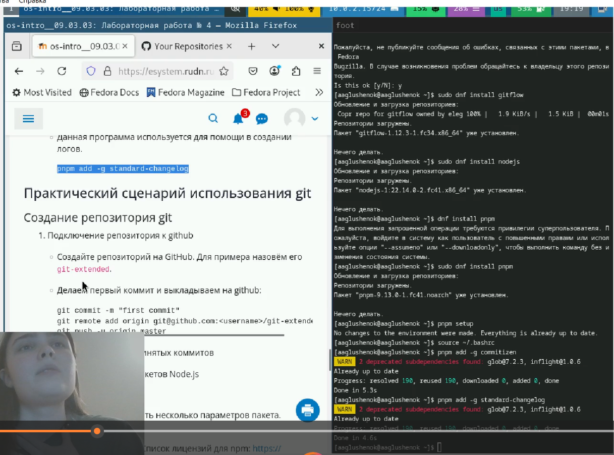
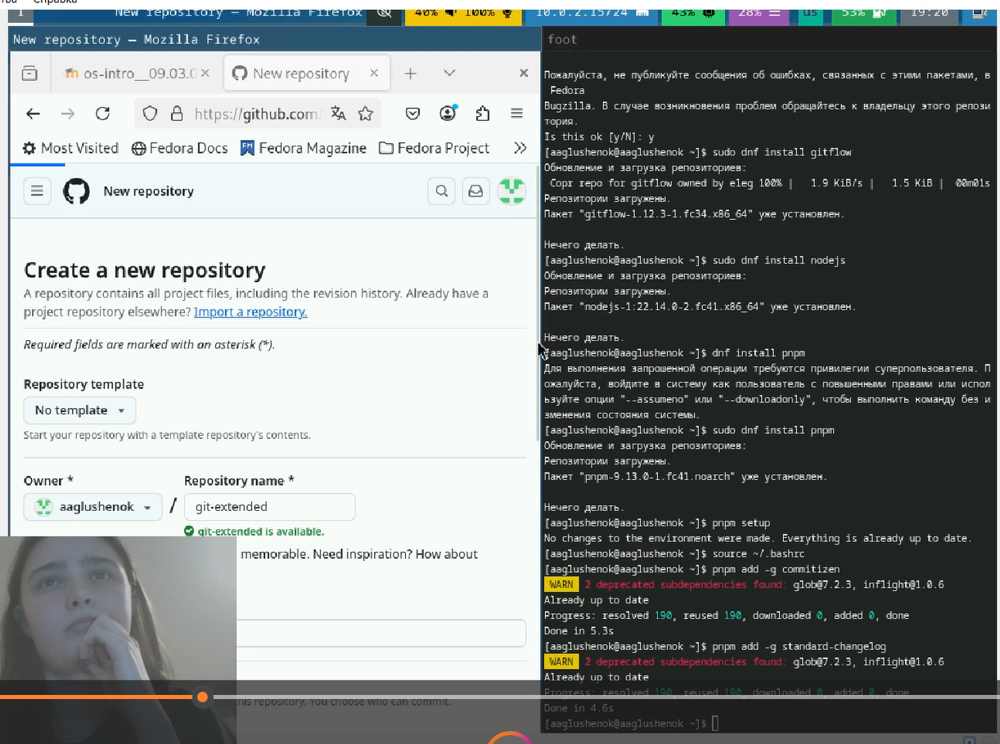
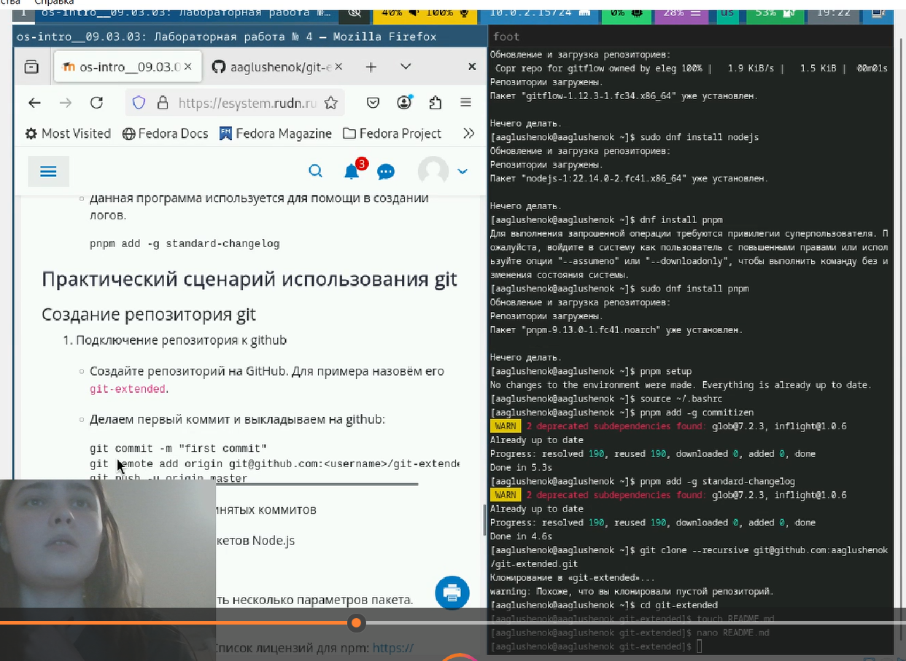
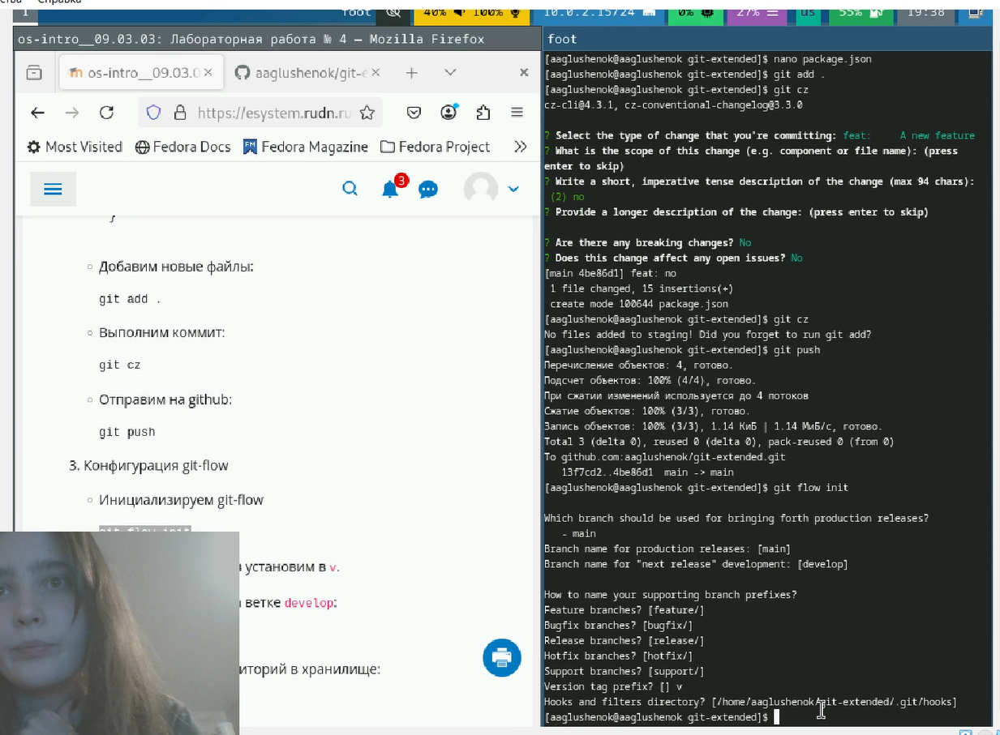
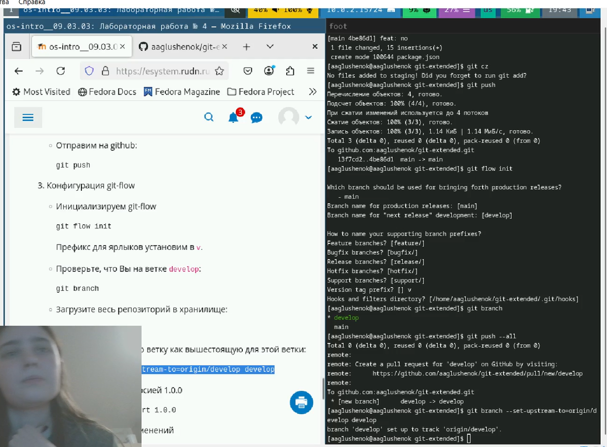
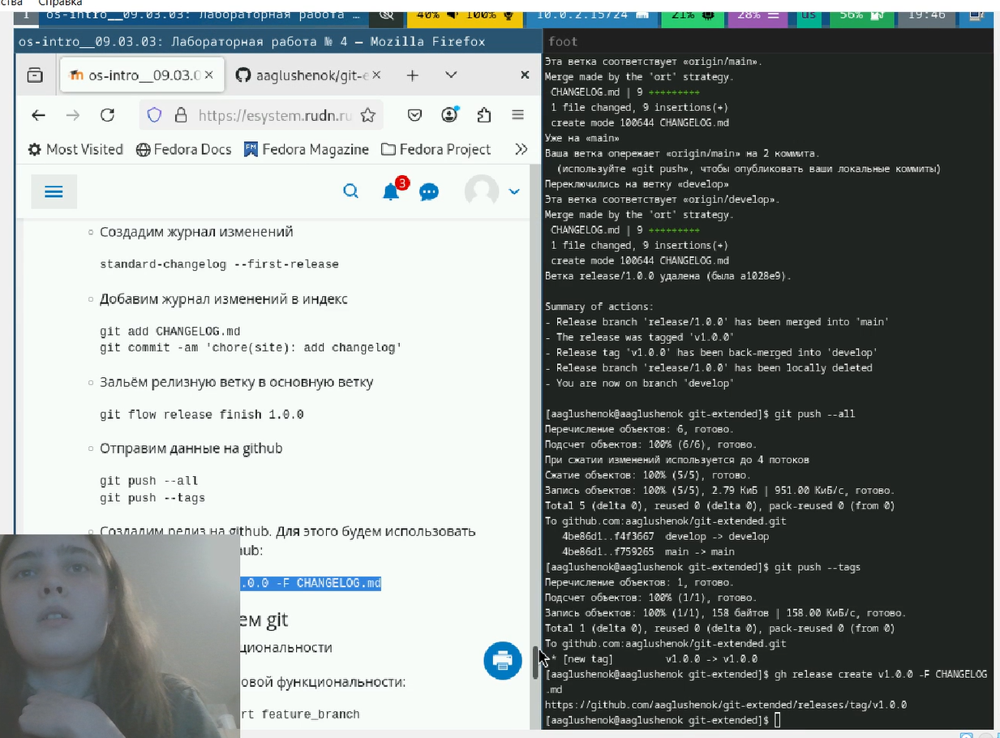
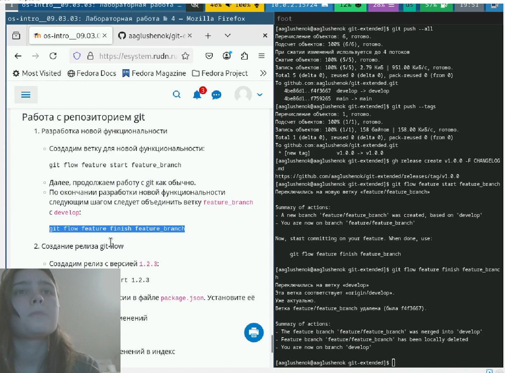
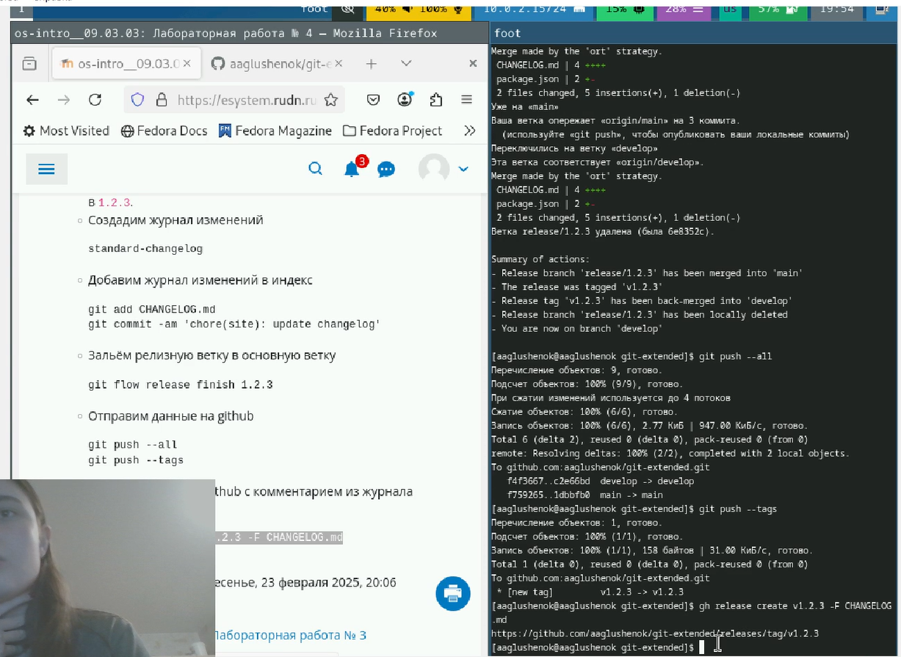
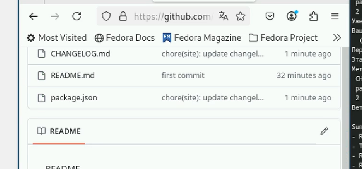

---
## Front matter
lang: ru-RU
title: Лабораторная работы №4. Работа с программными пакетами.
subtitle: Презентация
author:
  - Глушенок А. А.
institute:
  - Российский университет дружбы народов, Москва, Россия
date: 06 сентября 2025

## i18n babel
babel-lang: russian
babel-otherlangs: english

## Formatting pdf
toc: false
toc-title: Содержание
slide_level: 2
aspectratio: 169
section-titles: true
theme: metropolis
header-includes:
 - \metroset{progressbar=frametitle,sectionpage=progressbar,numbering=fraction}
 
## Fonts
mainfont: PT Serif
romanfont: PT Serif
sansfont: PT Sans
monofont: PT Mono
mainfontoptions: Ligatures=TeX
romanfontoptions: Ligatures=TeX
sansfontoptions: Ligatures=TeX,Scale=MatchLowercase
monofontoptions: Scale=MatchLowercase,Scale=0.9
---

## Докладчик

:::::::::::::: {.columns align=center}
::: {.column width="70%"}

  * Глушенок Анна Александровна
  * Студент НПИбд-01-24
  * Факультет физико-математических и естественных наук
  * Российский университет дружбы народов
  * [1132246844@pfur.ru](mailto:1132246844@pfur.ru)
  * <https://github.com/aaglushenok>

:::
::: {.column width="30%"}

:::
::::::::::::::

## Цель работы

Получить навыки работы с репозиториями и менеджерами пакетов.

## Работа с репозиториями

1. В консоли перейдите в режим работы суперпользователя. 
2. Перейдите в каталог /etc/yum.repos.d и изучите содержание каталога и файлов репозиториев.

{#fig:001 width=40%}

## Работа с репозиториями

3. Выведите на экран список репозиториев.

{#fig:002 width=40%}

## Работа с репозиториями

4. Выведите на экран список пакетов, в названии или описании которых есть слово user.

{#fig:003 width=40%}

## Работа с репозиториями

5. Установите nmap, предварительно изучив информацию по имеющимся пакетам.

{#fig:004 width=40%}

## Работа с репозиториями

{#fig:005 width=40%}

## Работа с репозиториями

6. Удалите nmap.

{#fig:006 width=40%}

## Работа с репозиториями

{#fig:007 width=40%}

## Работа с репозиториями

7. Получите список имеющихся групп пакетов, затем установите группу пакетов
RPM Development Tools. Для удаления группы пакетов RPM Development Tools можно воспользоваться командой dnf groupremove "RPM Development Tools".

{#fig:008 width=40%}

## Работа с репозиториями

{#fig:009 width=40%}

## Работа с репозиториями

{#fig:010 width=40%}

## Работа с репозиториями

{#fig:011 width=40%}

## Работа с репозиториями

{#fig:012 width=40%}

## Работа с репозиториями

8. Посмотрите историю использования команды dnf. Отмените последнее действие.

{#fig:013 width=40%}

## Работа с репозиториями

{#fig:014 width=40%}

## Работа с репозиториями

{#fig:015 width=40%}

## Использование rpm

Предположим, что требуется установить текстовый браузер lynx из rpm-пакета.

1. Скачайте rpm-пакет lynx:

{#fig:016 width=40%}

## Использование rpm

2. Найдите каталог, в который был помещён пакет после загрузки.
3. Перейдите в этот каталог и затем установите rpm-пакет.
4. Определите расположение исполняемого файла.

{#fig:017 width=40%}

## Использование rpm

5. Используя rpm, определите по имени файла, к какому пакету принадлежит lynx. Получите дополнительную информацию о содержимом пакета.

{#fig:018 width=40%}

## Использование rpm

6. Получите список всех файлов в пакете, используя. А так же выведите перечень файлов с документацией пакета. Посмотрите файлы документации, применив команду man lynx.

{#fig:019 width=40%}

## Использование rpm

{#fig:020 width=40%}

## Использование rpm

{#fig:021 width=40%}

## Использование rpm

7. Выведите на экран перечень и месторасположение конфигурационных файлов пакета.
8. Выведите на экран расположение и содержание скриптов, выполняемых при установке пакета.

{#fig:022 width=40%}

## Использование rpm

9. В отдельном терминале под своей учётной записью запустите текстовый браузер lynx, чтобы проверить корректность установки пакета.

{#fig:023 width=40%}

## Использование rpm

10. Вернитесь в терминал с учётной записью root и удалите пакет.

{#fig:024 width=40%}

## Использование rpm

Предположим, что требуется из rpm-пакетов установить dnsmasq (DNS-, DHCP- и TFTP- сервер).

1. Установите пакет dnsmasq.

{#fig:025 width=40%}

## Использование rpm

2. Определите размер исполняемого файла. Определите расположение исполняемого файла. Определите по имени файла, к какому пакету принадлежит dnsmasq и получите дополнительную информацию о содержимом пакета.

{#fig:026 width=40%}

## Использование rpm

3. Получите список всех файлов в пакете. А также выведите перечень файлов с документацией пакета. Посмотрите файлы документации, применив команду man dnsmasq.

{#fig:027 width=40%}

## Использование rpm

{#fig:028 width=40%}

## Использование rpm

4. Выведите на экран перечень и месторасположение конфигурационных файлов пакета.
5. Выведите на экран расположение и содержание скриптов, выполняемых при установке пакета.

{#fig:029 width=40%}

## Использование rpm

6. Вернитесь в терминал с учётной записью root и удалите пакет dnsmasq.

{#fig:030 width=40%}

## Выводы

В ходе выполнения лабораторной работы №4 мне удалось получить навыки работы с репозиториями и менеджерами пакетов.

## Благодарю за внимание!
