---
## Front matter
title: "Лабораторная работа №4. Работа с программными пакетами"
subtitle: "Отчет"
author: "Анна Александровна Глушенок"

## Generic otions
lang: ru-RU
toc-title: "Содержание"

## Bibliography
bibliography: bib/cite.bib
csl: pandoc/csl/gost-r-7-0-5-2008-numeric.csl

## Pdf output format
toc: true # Table of contents
toc-depth: 2
lof: true # List of figures
lot: true # List of tables
fontsize: 12pt
linestretch: 1.5
papersize: a4
documentclass: scrreprt
## I18n polyglossia
polyglossia-lang:
  name: russian
  options:
	- spelling=modern
	- babelshorthands=true
polyglossia-otherlangs:
  name: english
## I18n babel
babel-lang: russian
babel-otherlangs: english
## Fonts
mainfont: IBM Plex Serif
romanfont: IBM Plex Serif
sansfont: IBM Plex Sans
monofont: IBM Plex Mono
mathfont: STIX Two Math
mainfontoptions: Ligatures=Common,Ligatures=TeX,Scale=0.94
romanfontoptions: Ligatures=Common,Ligatures=TeX,Scale=0.94
sansfontoptions: Ligatures=Common,Ligatures=TeX,Scale=MatchLowercase,Scale=0.94
monofontoptions: Scale=MatchLowercase,Scale=0.94,FakeStretch=0.9
mathfontoptions:
## Biblatex
biblatex: true
biblio-style: "gost-numeric"
biblatexoptions:
  - parentracker=true
  - backend=biber
  - hyperref=auto
  - language=auto
  - autolang=other*
  - citestyle=gost-numeric
## Pandoc-crossref LaTeX customization
figureTitle: "Рис."
tableTitle: "Таблица"
listingTitle: "Листинг"
lofTitle: "Список иллюстраций"
lotTitle: "Список таблиц"
lolTitle: "Листинги"
## Misc options
indent: true
header-includes:
  - \usepackage{indentfirst}
  - \usepackage{float} # keep figures where there are in the text
  - \floatplacement{figure}{H} # keep figures where there are in the text
---

# Цель работы

Получить навыки работы с репозиториями и менеджерами пакетов.

# Выполнение лабораторной работы

## Работа с репозиториями

1. В консоли перейдите в режим работы суперпользователя. 
2. Перейдите в каталог /etc/yum.repos.d и изучите содержание каталога и файлов репозиториев.

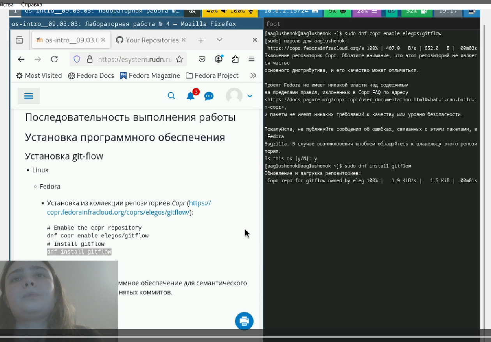{#fig:001 width=80%}

3. Выведите на экран список репозиториев.

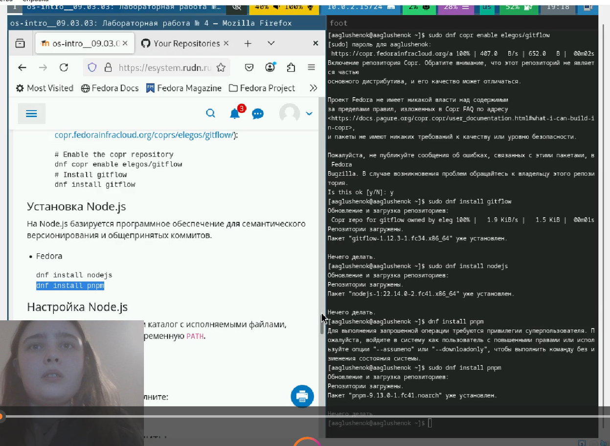{#fig:002 width=80%}

4. Выведите на экран список пакетов, в названии или описании которых есть слово user.

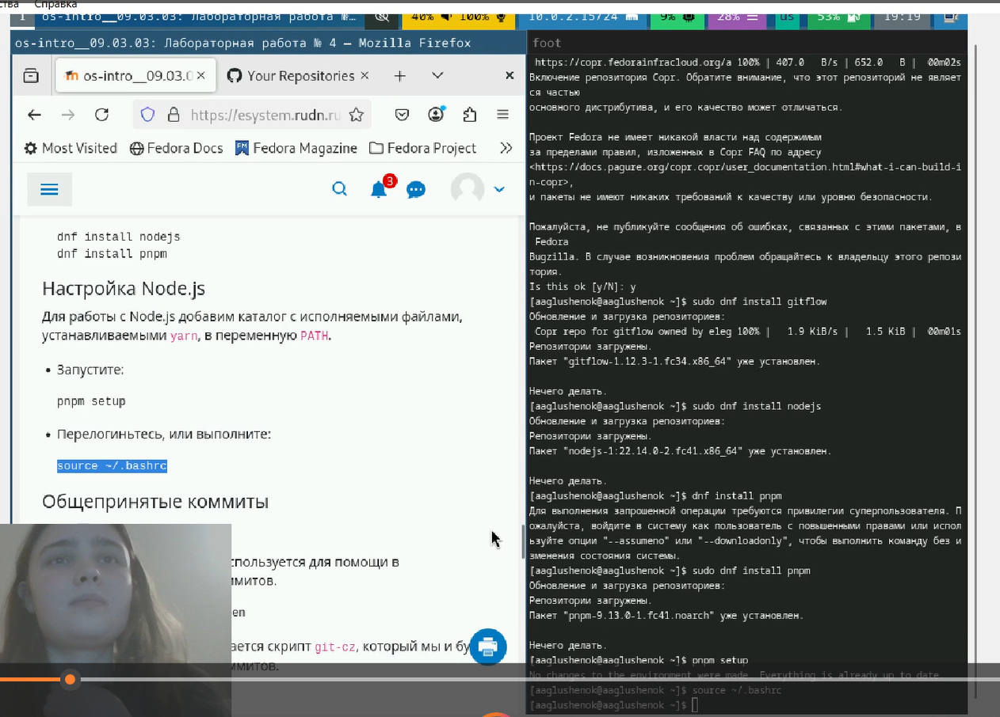{#fig:003 width=80%}

5. Установите nmap, предварительно изучив информацию по имеющимся пакетам.

{#fig:004 width=80%}

{#fig:005 width=80%}

6. Удалите nmap.

{#fig:006 width=80%}

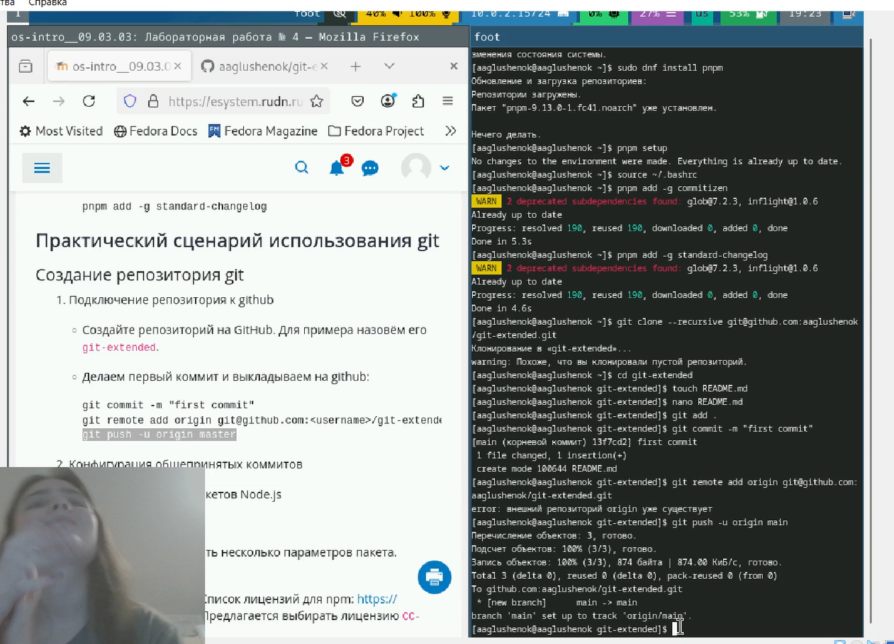{#fig:007 width=80%}

7. Получите список имеющихся групп пакетов, затем установите группу пакетов
RPM Development Tools. Для удаления группы пакетов RPM Development Tools можно воспользоваться командой dnf groupremove "RPM Development Tools".

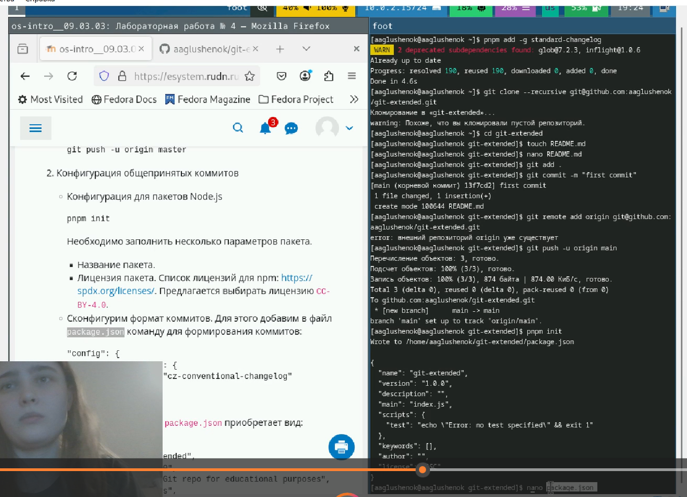{#fig:008 width=80%}

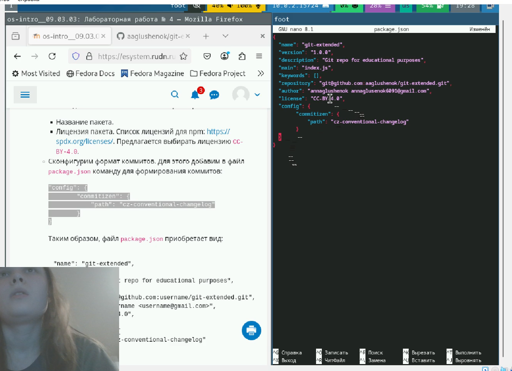{#fig:009 width=80%}

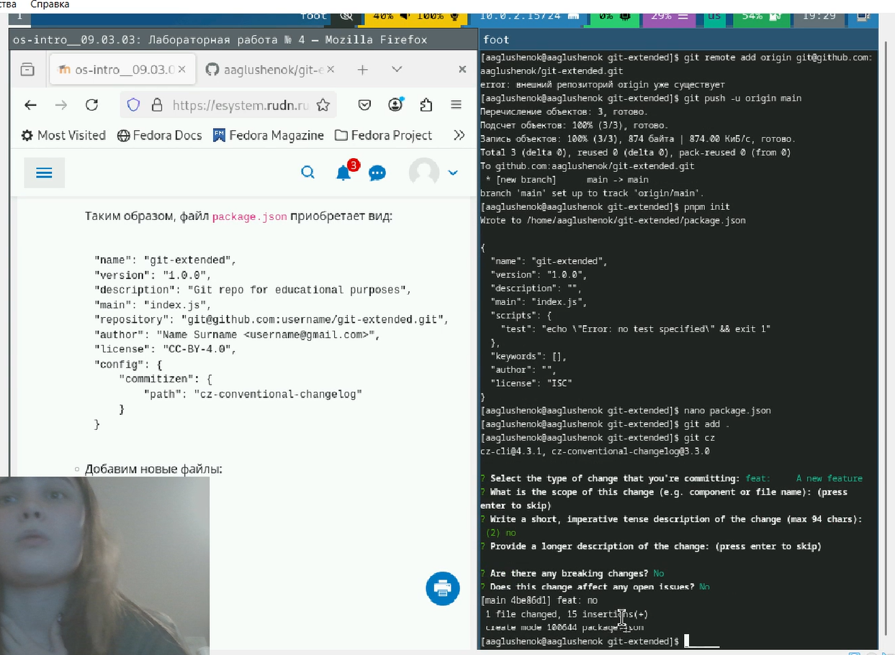{#fig:010 width=80%}

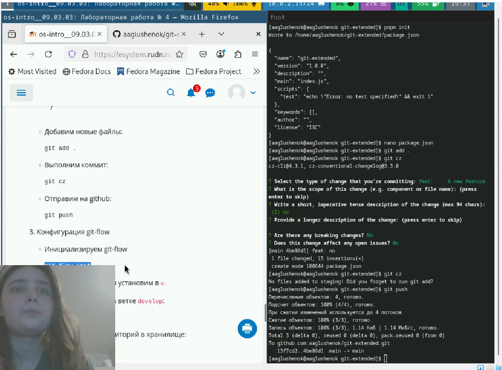{#fig:011 width=80%}

{#fig:012 width=80%}

8. Посмотрите историю использования команды dnf. Отмените последнее действие.

{#fig:013 width=80%}

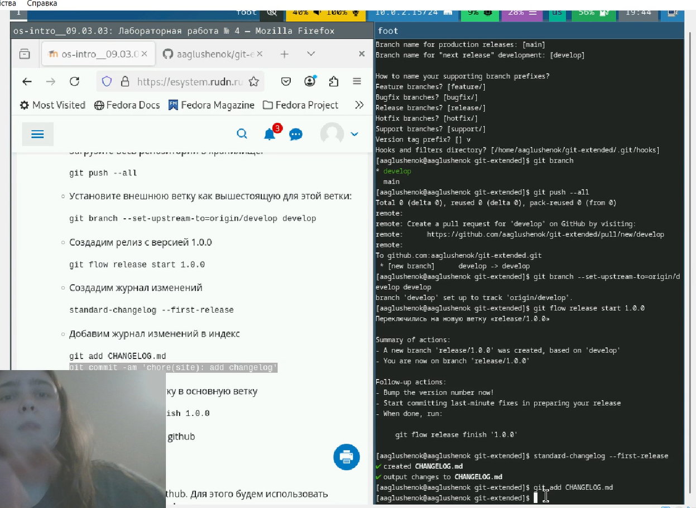{#fig:014 width=80%}

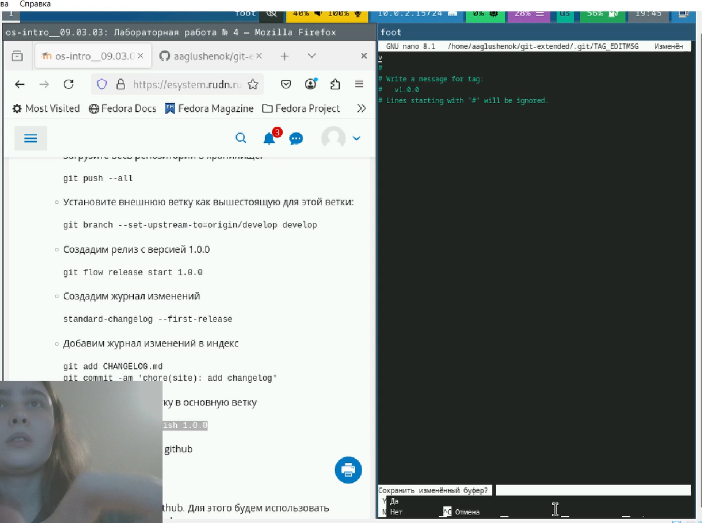{#fig:015 width=80%}

## Использование rpm

Предположим, что требуется установить текстовый браузер lynx из rpm-пакета.

1. Скачайте rpm-пакет lynx:

{#fig:016 width=80%}

2. Найдите каталог, в который был помещён пакет после загрузки.
3. Перейдите в этот каталог и затем установите rpm-пакет.
4. Определите расположение исполняемого файла.

{#fig:017 width=80%}

5. Используя rpm, определите по имени файла, к какому пакету принадлежит lynx. Получите дополнительную информацию о содержимом пакета.

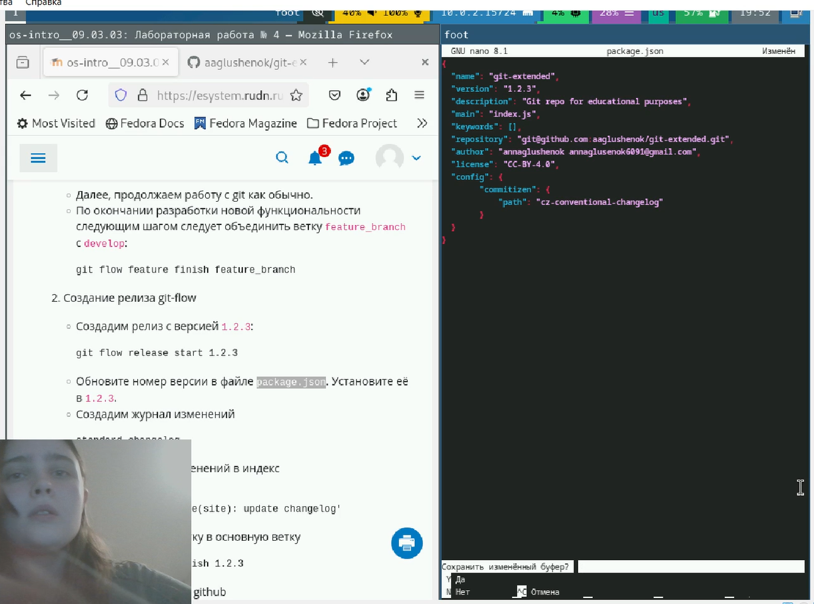{#fig:018 width=80%}

6. Получите список всех файлов в пакете, используя. А так же выведите перечень файлов с документацией пакета. Посмотрите файлы документации, применив команду man lynx.

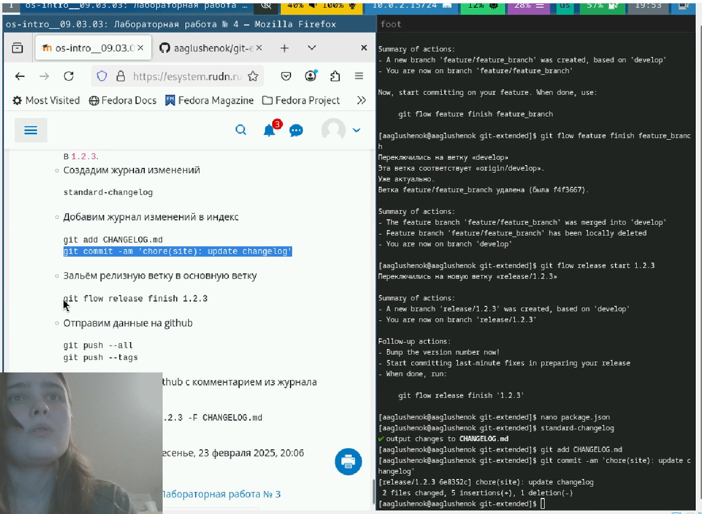{#fig:019 width=80%}

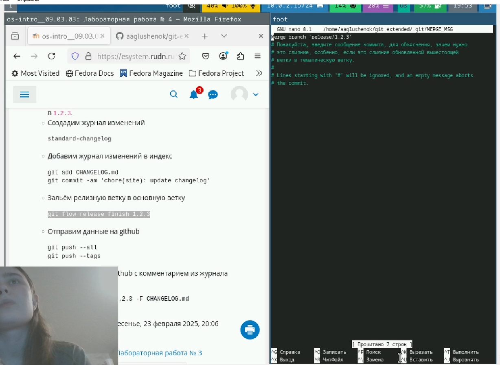{#fig:020 width=80%}

{#fig:021 width=80%}

7. Выведите на экран перечень и месторасположение конфигурационных файлов пакета.
8. Выведите на экран расположение и содержание скриптов, выполняемых при установке пакета.

{#fig:022 width=80%}

9. В отдельном терминале под своей учётной записью запустите текстовый браузер lynx, чтобы проверить корректность установки пакета.

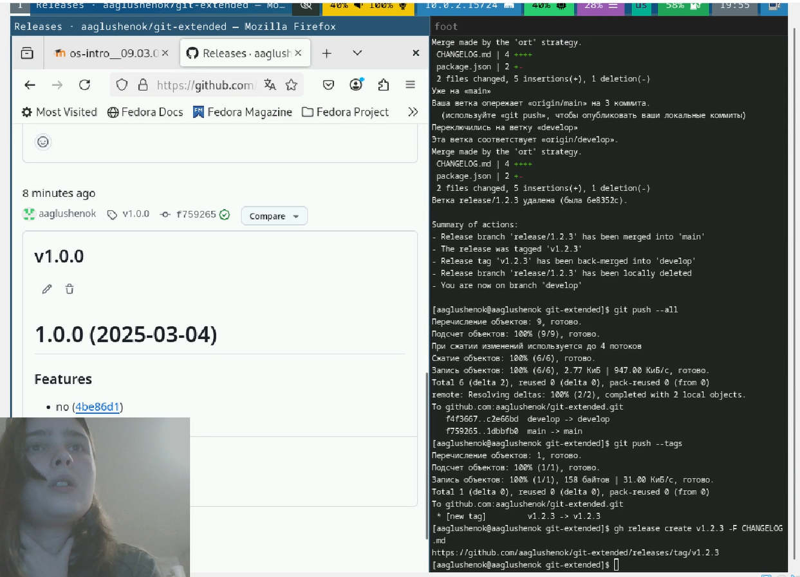{#fig:023 width=80%}

10. Вернитесь в терминал с учётной записью root и удалите пакет.

{#fig:024 width=80%}

Предположим, что требуется из rpm-пакетов установить dnsmasq (DNS-, DHCP- и TFTP- сервер).

1. Установите пакет dnsmasq.

{#fig:025 width=80%}

2. Определите размер исполняемого файла. Определите расположение исполняемого файла. Определите по имени файла, к какому пакету принадлежит dnsmasq и получите дополнительную информацию о содержимом пакета.

{#fig:026 width=80%}

3. Получите список всех файлов в пакете. А также выведите перечень файлов с документацией пакета. Посмотрите файлы документации, применив команду man dnsmasq.

{#fig:027 width=80%}

{#fig:028 width=80%}

4. Выведите на экран перечень и месторасположение конфигурационных файлов пакета.
5. Выведите на экран расположение и содержание скриптов, выполняемых при установке пакета.

{#fig:029 width=80%}

6. Вернитесь в терминал с учётной записью root и удалите пакет dnsmasq.

{#fig:030 width=80%}

# Контрольные вопросы

1.  Какая команда позволяет вам искать пакет rpm, содержащий файл useradd?
Команда для поиска пакета rpm, содержащего файл useradd — dnf provides */useradd или rpm -qf /usr/sbin/useradd (если путь к файлу известен).

2.  Какие команды вам нужно использовать, чтобы показать имя группы dnf, которая содержит инструменты безопасности и показывает, что находится в этой группе?
Чтобы показать имя группы dnf с инструментами безопасности, используйте dnf group list | grep -i security. Чтобы показать, что находится в этой группе, используйте dnf group info "Имя_группы".

3.  Какая команда позволяет вам установить rpm, который вы загрузили из Интернета и который не находится в репозиториях?
Команда для установки локального rpm-пакета — dnf install /путь/к/файлу.rpm.

4.  Вы хотите убедиться, что пакет rpm, который вы загрузили, не содержит никакого опасного кода сценария. Какая команда позволяет это сделать?
Проверить скрипты внутри rpm-пакета позволяет команда rpm -qp --scripts имя_файла.rpm.

5.  Какая команда показывает всю документацию в rpm?
Показать всю документацию, которая поставляется с установленным пакетом, позволяет команда rpm -qd имя_пакета.

6.  Какая команда показывает, какому пакету rpm принадлежит файл?
Команда, которая показывает, какому установленному пакету принадлежит файл — rpm -qf /путь/к/файлу.

# Выводы

В ходе выполнения лабораторной работы №4 мне удалось получить навыки работы с репозиториями и менеджерами пакетов.

# Список литературы{.unnumbered}

::: {#refs}
:::
