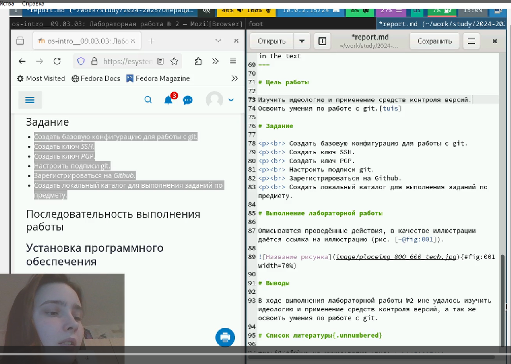

---
## Front matter
lang: ru-RU
title: Лабораторная работы №9. Командная оболочка Midnight Commander
subtitle: Презентация
author:
  - Глушенок А. А.
institute:
  - Российский университет дружбы народов, Москва, Россия
date: 18 марта 2025

## i18n babel
babel-lang: russian
babel-otherlangs: english

## Formatting pdf
toc: false
toc-title: Содержание
slide_level: 2
aspectratio: 169
section-titles: true
theme: metropolis
header-includes:
 - \metroset{progressbar=frametitle,sectionpage=progressbar,numbering=fraction}
 
## Fonts
mainfont: PT Serif
romanfont: PT Serif
sansfont: PT Sans
monofont: PT Mono
mainfontoptions: Ligatures=TeX
romanfontoptions: Ligatures=TeX
sansfontoptions: Ligatures=TeX,Scale=MatchLowercase
monofontoptions: Scale=MatchLowercase,Scale=0.9
---

## Докладчик

:::::::::::::: {.columns align=center}
::: {.column width="70%"}

  * Глушенок Анна Александровна
  * Студент НПИбд-01-24
  * Факультет физико-математических и естественных наук
  * Российский университет дружбы народов
  * [1132246844@pfur.ru](mailto:1132246844@pfur.ru)
  * <https://github.com/aaglushenok/study_2024-2025_arh-pc>

:::
::: {.column width="30%"}

:::
::::::::::::::

## Цель работы

Освоение основных возможностей командной оболочки Midnight Commander. Приобретение навыков практической работы по просмотру каталогов и файлов; манипуляций с ними.

## Задание 1

1. Изучите информацию о mc, вызвав в командной строке man mc.

{#fig:001 width=60%}

## Задание 2

2. Запустите из командной строки mc, изучите его структуру и меню.

Меню содержит разделы левая панель, файл, комнада, настройки, правая панель. Так же есть нижнее меню. Примеры элементов меню:

{#fig:002 width=15%}

{#fig:003 width=15%}

{#fig:004 width=15%}

## Задание 3 (1)

3. Выполните несколько операций в mc, используя управляющие клавиши (операции с панелями; выделение/отмена выделения файлов, копирование/перемещение файлов, получение информации о размере и правах доступа на файлы и/или каталоги и т.п.)

{#fig:008 width=15%}

{#fig:009 width=15%}

{#fig:010 width=15%}

## Задание 3 (2)

{#fig:011 width=80%}

{#fig:012 width=80%}

{#fig:013 width=80%}

## Задание 4

4. Выполните основные команды меню левой (или правой) панели. Оцените степень подробности вывода информации о файлах.

Примеры использования команд из меню правой панели: 

{#fig:005 width=15%}

{#fig:006 width=15%}

## Задание 5 (1)

5. Используя возможности подменю Файл , выполните:
– просмотр содержимого текстового файла;

{#fig:014 width=20%}

– редактирование содержимого текстового файла (без сохранения результатов редактирования);

{#fig:015 width=20%}

## Задание 5 (2)

– создание каталога;

{#fig:016 width=15%}

{#fig:017 width=15%}

– копирование в файлов в созданный каталог.

{#fig:018 width=15%}

## Задание 6 (1)

6. С помощью соответствующих средств подменю Команда осуществите:
– поиск в файловой системе файла с заданными условиями (например, файла с расширением .c или .cpp, содержащего строку main);

{#fig:019 width=20%}

{#fig:020 width=20%}

## Задание 6 (2)

– выбор и повторение одной из предыдущих команд;

{#fig:021 width=15%}

{#fig:022 width=15%}

## Задание 6 (3)

– переход в домашний каталог;

{#fig:023 width=15%}

{#fig:024 width=15%}

## Задание 6 (4)

– анализ файла меню и файла расширений.

{#fig:025 width=15%}

{#fig:026 width=15%}

{#fig:027 width=15%}

## Задание 7

7. Вызовите подменю Настройки. Освойте операции, определяющие структуру экрана mc (Full screen, Double Width, Show Hidden Files и т.д.)

Примеры командр подменю настройки:

{#fig:028 width=15%}

{#fig:029 width=15%}

{#fig:030 width=15%}

## Задание 1

1. Создайте текстовой файл text.txt.

{#fig:031 width=60%}

## Задание 2-3

2. 3. Откройте этот файл с помощью встроенного в mc редактора.Вставьте в открытый файл небольшой фрагмент текста, скопированный из любого другого файла или Интернета.

{#fig:032 width=60%}

## Задание 4 (1)

4. Проделайте с текстом следующие манипуляции, используя горячие клавиши:
4.1. Удалите строку текста.

{#fig:033 width=15%}

4.2. Выделите фрагмент текста и скопируйте его на новую строку.

{#fig:034 width=15%}

## Задание 4 (2)

4.3. Выделите фрагмент текста и перенесите его на новую строку.

{#fig:035 width=50%}

4.5. Отмените последнее действие: ctrl + z

## Задание 4 (3)

4.6., 4.7. Перейдите в конец файла (нажав комбинацию клавиш) и напишите некоторый текст.Перейдите в начало файла (нажав комбинацию клавиш) и напишите некоторый текст.

{#fig:036 width=50%}

4.8. Сохраните и закройте файл: f2

## Задание 5-6

5. 6. Откройте файл с исходным текстом на некотором языке программирования (например C или Java). Используя меню редактора, включите подсветку синтаксиса, если она не включена,
или выключите, если она включена.

{#fig:037 width=20%}

{#fig:038 width=20%}

# Выводы

В ходе выполнения лабораторной работы № 8 мне удалось ознакомиться с инструментами поиска файлов и фильтрации текстовых данных, приобрести практически навыки: по управлению процессами (и заданиями), по проверке использования диска и обслуживанию файловых систем.

## 
Благодарю за внимание! 
