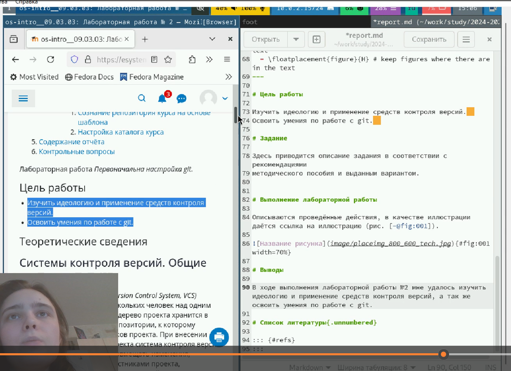
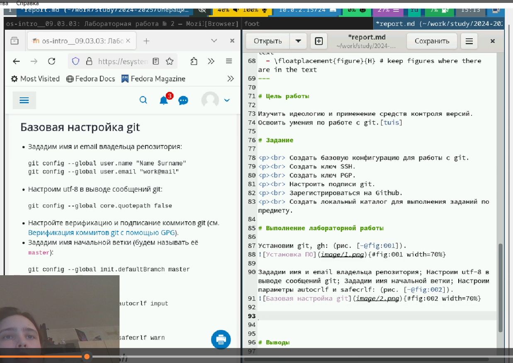

---
## Front matter
lang: ru-RU
title: Лабораторная работы №10. Текстовой редактор vi
subtitle: Презентация
author:
  - Глушенок А. А.
institute:
  - Российский университет дружбы народов, Москва, Россия
date: 18 марта 2025

## i18n babel
babel-lang: russian
babel-otherlangs: english

## Formatting pdf
toc: false
toc-title: Содержание
slide_level: 2
aspectratio: 169
section-titles: true
theme: metropolis
header-includes:
 - \metroset{progressbar=frametitle,sectionpage=progressbar,numbering=fraction}
 
## Fonts
mainfont: PT Serif
romanfont: PT Serif
sansfont: PT Sans
monofont: PT Mono
mainfontoptions: Ligatures=TeX
romanfontoptions: Ligatures=TeX
sansfontoptions: Ligatures=TeX,Scale=MatchLowercase
monofontoptions: Scale=MatchLowercase,Scale=0.9
---

## Докладчик

:::::::::::::: {.columns align=center}
::: {.column width="70%"}

  * Глушенок Анна Александровна
  * Студент НПИбд-01-24
  * Факультет физико-математических и естественных наук
  * Российский университет дружбы народов
  * [1132246844@pfur.ru](mailto:1132246844@pfur.ru)
  * <https://github.com/aaglushenok/study_2024-2025_arh-pc>

:::
::: {.column width="30%"}

:::
::::::::::::::

## Цель работы

Познакомиться с операционной системой Linux. Получить практические навыки работы с редактором vi, установленным по умолчанию практически во всех дистрибутивах.

## задания 1-3

1. Создайте каталог с именем ~/work/os/lab06.
2. Перейдите во вновь созданный каталог.
3. Вызовите vi и создайте файл hello.sh

{#fig:001 width=50%}

## задание 4

4. Нажмите клавишу i и вводите текст

{#fig:002 width=60%}

## задания 5-7

5. Нажмите клавишу Esc для перехода в командный режим после завершения ввода текста.
6. Нажмите : для перехода в режим последней строки и внизу вашего экрана появится приглашение в виде двоеточия.
7. Нажмите w (записать) и q (выйти), а затем нажмите клавишу Enter для сохранения
вашего текста и завершения работы

{#fig:003 width=40%}

## задание 8

8. Сделайте файл исполняемым

{#fig:004 width=60%}

## задание 1

1. Вызовите vi на редактирование файла

{#fig:005 width=60%}

## задания 2-3

2. Установите курсор в конец слова HELL второй строки.
3. Перейдите в режим вставки и замените на HELLO. Нажмите Esc для возврата в командный режим.

{#fig:006 width=50%}

## задания 4-5

4. Установите курсор на четвертую строку и сотрите слово LOCAL.
5. Перейдите в режим вставки и наберите следующий текст: local, нажмите Esc для возврата в командный режим

{#fig:007 width=50%}

## задания 6-7

6. Установите курсор на последней строке файла. Вставьте после неё строку, содержащую следующий текст: echo $HELLO.
7. Нажмите Esc для перехода в командный режим.

{#fig:008 width=50%}

## задания 8-9

8. Удалите последнюю строку.

{#fig:009 width=80%}

9. Введите команду отмены изменений u для отмены последней команды.

{#fig:010 width=50%}

## задание 10

10. Введите символ : для перехода в режим последней строки. Запишите произведённые изменения и выйдите из vi

{#fig:011 width=60%}

## Выводы

В ходе выполнения лабораторной работы № 10 мне удалось познакомиться с операционной системой Linux, получить практические навыки работы с редактором vi, установленным по умолчанию практически во всех дистрибутивах.

## 
Благодарю за внимание! 
