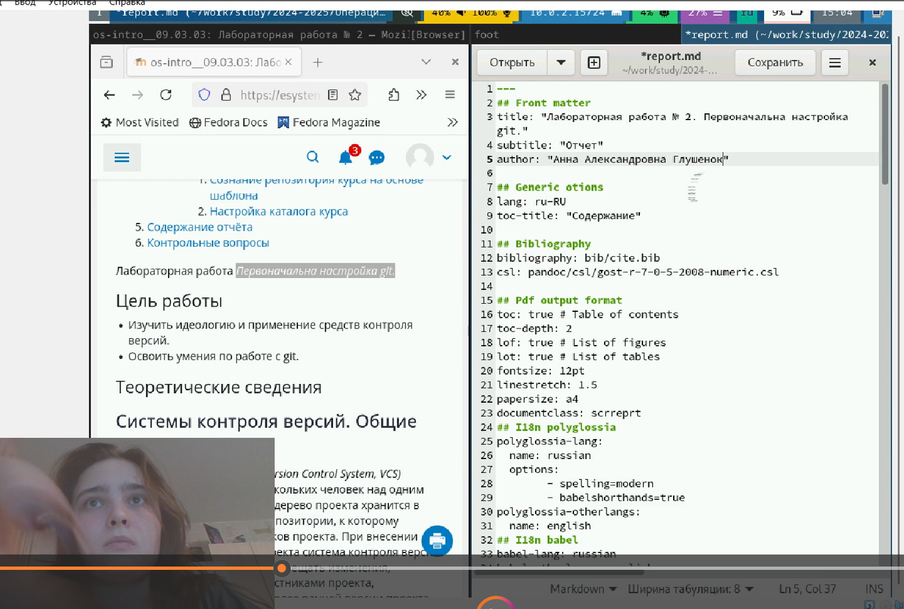
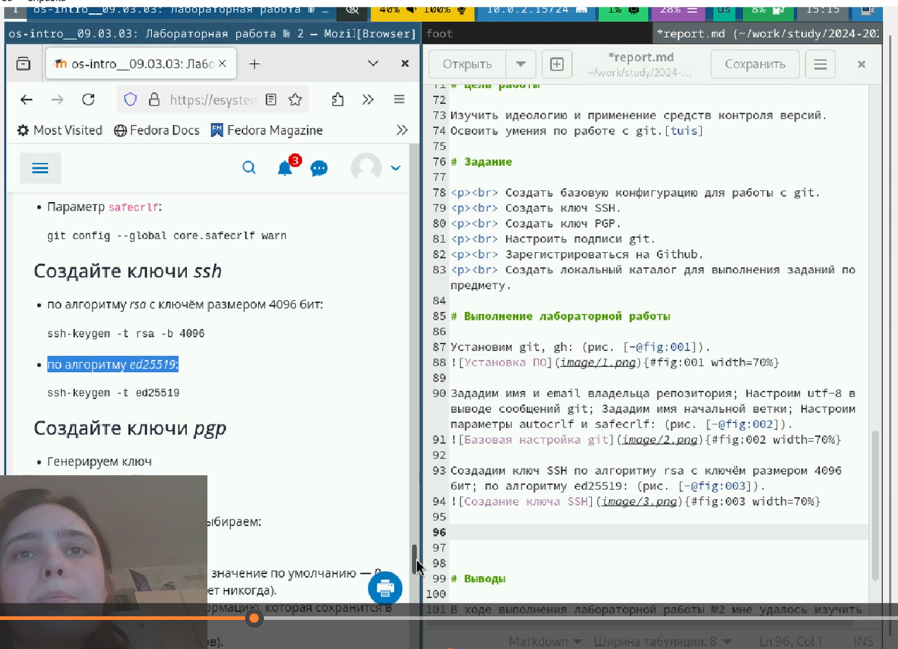
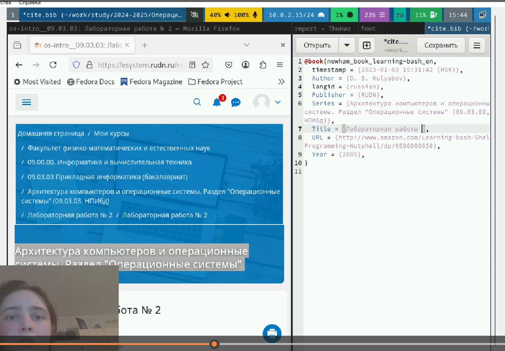

---
## Front matter
lang: ru-RU
title: Лабораторная работы №12. Программирование в командном процессоре ОС UNIX. Командные файл
subtitle: Презентация
author:
  - Глушенок А. А.
institute:
  - Российский университет дружбы народов, Москва, Россия
date: 18 марта 2025

## i18n babel
babel-lang: russian
babel-otherlangs: english

## Formatting pdf
toc: false
toc-title: Содержание
slide_level: 2
aspectratio: 169
section-titles: true
theme: metropolis
header-includes:
 - \metroset{progressbar=frametitle,sectionpage=progressbar,numbering=fraction}
 
## Fonts
mainfont: PT Serif
romanfont: PT Serif
sansfont: PT Sans
monofont: PT Mono
mainfontoptions: Ligatures=TeX
romanfontoptions: Ligatures=TeX
sansfontoptions: Ligatures=TeX,Scale=MatchLowercase
monofontoptions: Scale=MatchLowercase,Scale=0.9
---

## Докладчик

:::::::::::::: {.columns align=center}
::: {.column width="70%"}

  * Глушенок Анна Александровна
  * Студент НПИбд-01-24
  * Факультет физико-математических и естественных наук
  * Российский университет дружбы народов
  * [1132246844@pfur.ru](mailto:1132246844@pfur.ru)
  * <https://github.com/aaglushenok/study_2024-2025_arh-pc>

:::
::: {.column width="30%"}

:::
::::::::::::::

## Цель работы

Изучить основы программирования в оболочке ОС UNIX/Linux. Научиться писать небольшие командные файлы.

## Задание 1 (1)

Написать скрипт, который при запуске будет делать резервную копию самого себя (то есть файла, в котором содержится его исходный код) в другую директорию backup в вашем домашнем каталоге. При этом файл должен архивироваться одним из ар- хиваторов на выбор zip, bzip2 или tar. Способ использования команд архивации необходимо узнать, изучив справку.

## Задание 1 (2)

{#fig:001 width=30%}

{#fig:002 width=30%}

{#fig:003 width=30%}

## Задание 1 (3)

{#fig:004 width=30%}

{#fig:005 width=30%}

## Задание 2 (1)

Написать пример командного файла, обрабатывающего любое произвольное число аргументов командной строки, в том числе превышающее десять. Например, скрипт может последовательно распечатывать значения всех переданных аргументов.

{#fig:006 width=30%}

## Задание 2 (2)

{#fig:007 width=30%}

{#fig:008 width=30%}

## Задание 3 (1)

Написать командный файл — аналог команды ls (без использования самой этой команды и команды dir). Требуется, чтобы он выдавал информацию о нужном каталоге и выводил информацию о возможностях доступа к файлам этого каталога.

{#fig:009 width=30%}

## Задание 3 (2)

{#fig:010 width=30%}

{#fig:011 width=30%}

## Задание 4 (1)

Написать командный файл, который получает в качестве аргумента командной строки формат файла (.txt, .doc, .jpg, .pdf и т.д.) и вычисляет количество таких файлов в указанной директории. Путь к директории также передаётся в виде аргумента командной строки.

{#fig:012 width=30%}

## Задание 4 (2)

{#fig:013 width=30%}

{#fig:014 width=30%}

## Выводы

В ходе выполнения лабораторной работы № 12 мне удалось изучить основы программирования в оболочке ОС UNIX/Linux. Научиться писать небольшие командные файлы.

## 
Благодарю за внимание! 
