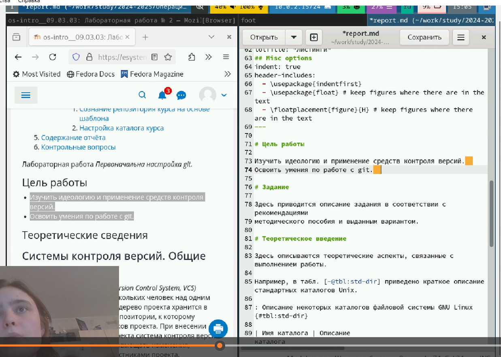

---
## Front matter
lang: ru-RU
title: Лабораторная работы №13. Фильтр пакетов
subtitle: Презентация
author:
  - Глушенок А. А.
institute:
  - Российский университет дружбы народов, Москва, Россия
date: 24 октября 2025

## i18n babel
babel-lang: russian
babel-otherlangs: english

## Formatting pdf
toc: false
toc-title: Содержание
slide_level: 2
aspectratio: 169
section-titles: true
theme: metropolis
header-includes:
 - \metroset{progressbar=frametitle,sectionpage=progressbar,numbering=fraction}
 
## Fonts
mainfont: PT Serif
romanfont: PT Serif
sansfont: PT Sans
monofont: PT Mono
mainfontoptions: Ligatures=TeX
romanfontoptions: Ligatures=TeX
sansfontoptions: Ligatures=TeX,Scale=MatchLowercase
monofontoptions: Scale=MatchLowercase,Scale=0.9
---

## Докладчик

:::::::::::::: {.columns align=center}
::: {.column width="70%"}

  * Глушенок Анна Александровна
  * Студент НПИбд-01-24
  * Факультет физико-математических и естественных наук
  * Российский университет дружбы народов
  * [1132246844@pfur.ru](mailto:1132246844@pfur.ru)
  * <https://github.com/aaglushenok>

:::
::: {.column width="30%"}

:::
::::::::::::::

## Цель работы

Получить навыки настройки пакетного фильтра в Linux.

## Задание  

1. Используя firewall-cmd:
– определить текущую зону по умолчанию;
– определить доступные для настройки зоны;
– определить службы, включённые в текущую зону;
– добавить сервер VNC в конфигурацию брандмауэра.
2. Используя firewall-config:
– добавьте службы http и ssh в зону public;
– добавьте порт 2022 протокола UDP в зону public;
– добавьте службу ftp.
3. Выполните задание для самостоятельной работы (раздел 13.5).

# Выполнение лабораторной работы

# Управление брандмауэром с помощью firewall-cmd

## Управление брандмауэром с помощью firewall-cmd

1. Получите полномочия администратора: su -
2. Определите текущую зону по умолчанию: firewall-cmd --get-default-zone
3. Определите доступные зоны: firewall-cmd --get-zones

{#fig:001 width=40%}

## Управление брандмауэром с помощью firewall-cmd

4. Посмотрите службы, доступные на ПК: firewall-cmd --get-services

{#fig:002 width=40%}

## Управление брандмауэром с помощью firewall-cmd

5. Определите доступные службы в текущей зоне: firewall-cmd --list-services

{#fig:003 width=40%}

## Управление брандмауэром с помощью firewall-cmd

6. Сравните результаты вывода команды firewall-cmd --list-all и команды firewall-cmd --list-all --zone=public

{#fig:004 width=40%} 

## Управление брандмауэром с помощью firewall-cmd

7. Добавьте сервер VNC в конфигурацию брандмауэра: firewall-cmd --add-service=vnc-server
8. Проверьте, добавился ли vnc-server в конфигурацию: firewall-cmd --list-all

{#fig:005 width=40%}

## Управление брандмауэром с помощью firewall-cmd

9. Перезапустите службу firewalld: systemctl restart firewalld
10. Проверьте, есть ли vnc-server в конфигурации: firewall-cmd --list-all

{#fig:006 width=40%}

## Управление брандмауэром с помощью firewall-cmd

11. Добавьте службу vnc-server ещё раз, но постоянной, используя firewall-cmd --add-service=vnc-server --permanent
12. Проверьте наличие vnc-server в конфигурации: firewall-cmd --list-all

{#fig:007 width=40%}

## Управление брандмауэром с помощью firewall-cmd

13. Перезагрузите конфигурацию firewalld и просмотрите конфигурацию времени
выполнения: firewall-cmd --reload, firewall-cmd --list-all

{#fig:008 width=40%}

## Управление брандмауэром с помощью firewall-cmd

14. Добавьте в конфигурацию межсетевого экрана порт 2022 протокола TCP: firewall-cmd --add-port=2022/tcp --permanent. Перезагрузите конфигурацию firewalld: firewall-cmd --reload
15. Проверьте, что порт добавлен в конфигурацию: firewall-cmd --list-all

{#fig:009 width=40%}

# Управление брандмауэром с помощью firewall-config

## Управление брандмауэром с помощью firewall-config

1. Откройте терминал под своим пользователем, запустите интерфейс GUI firewall-config: firewall-config

{#fig:010 width=40%}

## Управление брандмауэром с помощью firewall-config

2. Нажмите выпадающее меню рядом с Configuration -> выберите Permanent (сделает постоянными все внесенные изменения)

{#fig:01 width=40%}

## Управление брандмауэром с помощью firewall-config

3. Выберите зону public и отметьте службы http, https и ftp, чтобы включить их

{#fig:012 width=40%}

## Управление брандмауэром с помощью firewall-config

4. Выберите вкладку Ports -> Add. Введите порт 2022 и протокол udp -> ОК , чтобы добавить их

{#fig:013 width=40%}

## Управление брандмауэром с помощью firewall-config

5. Закройте утилиту firewall-config.
6. В терминале введите firewall-cmd --list-all (изменения ещё не вступили в силу, тк мы настроили их как постоянные, а не изменения времени выполнения)

{#fig:014 width=40%}

## Управление брандмауэром с помощью firewall-config

7. Перегрузите конфигурацию firewall-cmd: firewall-cmd --reload и выведите список доступных сервисов: firewall-cmd --list-all (изменения применены)

{#fig:015 width=40%}

# Самостоятельная работа

## Самостоятельная работа

1. Создайте конфигурацию межсетевого экрана, которая позволяет получить доступ к службам: telnet; imap; pop3; smtp.
2. Сделайте это как в командной строке (для службы telnet), так и в графическом интерфейсе (для служб imap, pop3, smtp).

Для telnet: добавляем через команду "...add srvice=..." :

{#fig:016 width=40%}

## Самостоятельная работа

Для остальных: firewalld-config -> конфигурация: постоянная -> public -> отмечаем заданные службы галочкой

{#fig:017 width=40%}

## Самостоятельная работа

3. Убедитесь, что конфигурация является постоянной и будет активирована после перезагрузки компьютера.

{#fig:018 width=40%}

## Вывод

В ходе выполнения лабораторной работы №13 мне удалось получить навыки настройки пакетного фильтра в Linux.

# Благодарю за внимание!
