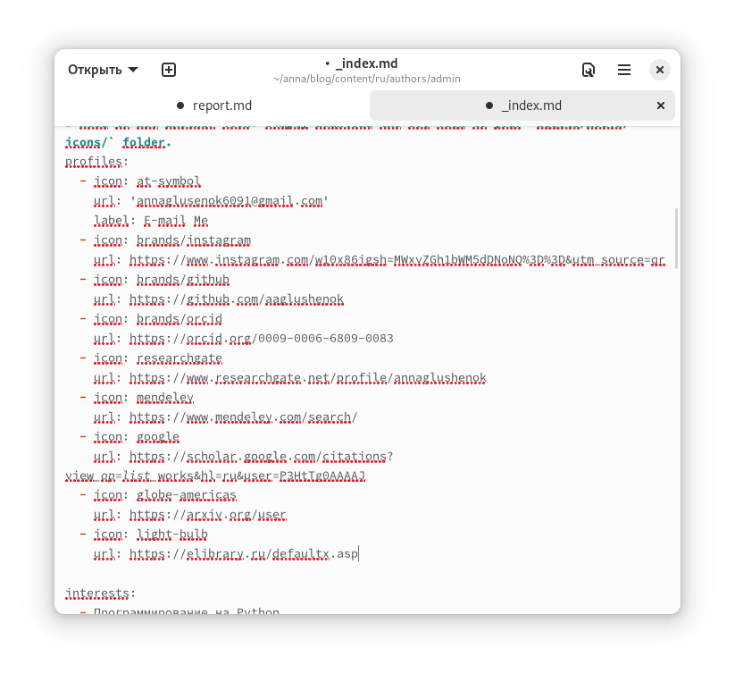
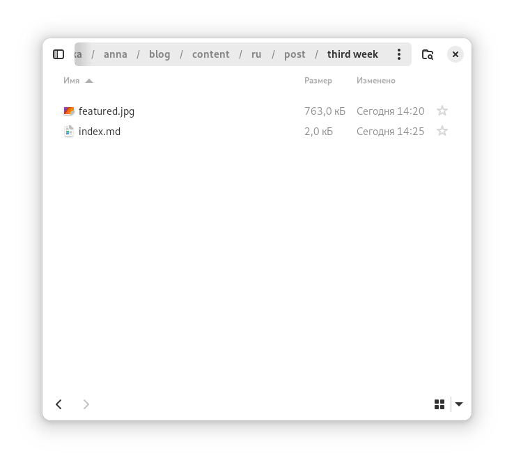
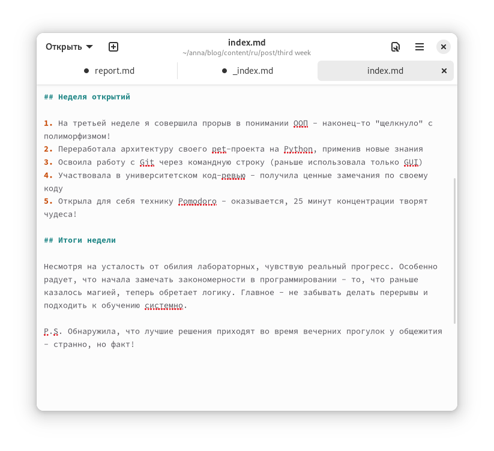
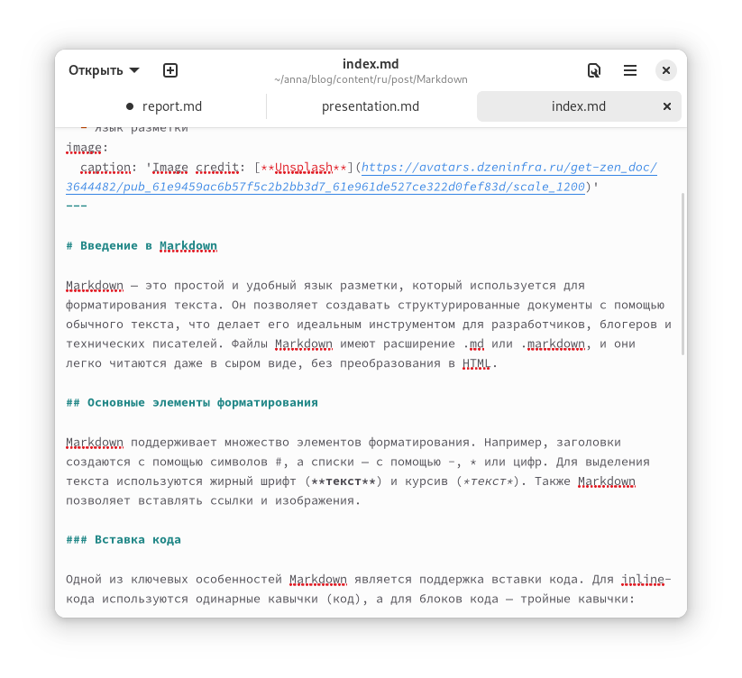
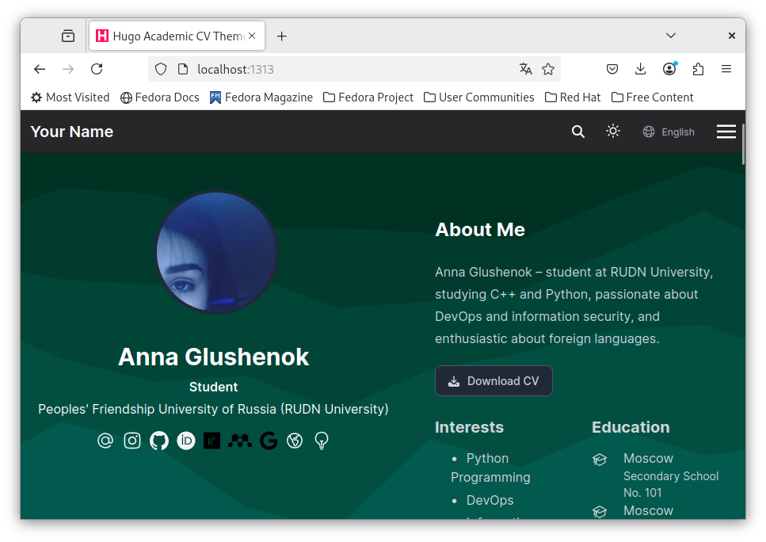

---
## Front matter
lang: ru-RU
title: Этап №4
subtitle: Добавляем ссылки на научные библотеки и ресурсы
author:
  - Глушенок А. А.
institute:
  - Российский университет дружбы народов, Москва, Россия
date: 18 марта 2025

## i18n babel
babel-lang: russian
babel-otherlangs: english

## Formatting pdf
toc: false
toc-title: Содержание
slide_level: 2
aspectratio: 169
section-titles: true
theme: metropolis
header-includes:
 - \metroset{progressbar=frametitle,sectionpage=progressbar,numbering=fraction}
 
## Fonts
mainfont: PT Serif
romanfont: PT Serif
sansfont: PT Sans
monofont: PT Mono
mainfontoptions: Ligatures=TeX
romanfontoptions: Ligatures=TeX
sansfontoptions: Ligatures=TeX,Scale=MatchLowercase
monofontoptions: Scale=MatchLowercase,Scale=0.9
---

## Докладчик

:::::::::::::: {.columns align=center}
::: {.column width="70%"}

  * Глушенок Анна Александровна
  * Студент НПИбд-01-24
  * Факультет физико-математических и естественных наук
  * Российский университет дружбы народов
  * [1132246844@pfur.ru](mailto:1132246844@pfur.ru)
  * <https://github.com/aaglushenok/study_2024-2025_arh-pc>

:::
::: {.column width="30%"}

:::
::::::::::::::

## Цель работы

Добавление на главную страницу ссылок на научные ресурсы

## Регистрируемся на ресурсах и добавляем ссылки на сайт

{#fig:001 width=60%}

## Создание нового каталога под пост

В каталоге content - post создаем новую папку(third week)

{#fig:002 width=60%}

## Редактирование файла поста

Добавляем в каталог фото поста и редактируем файл index с информацией о прошедшей неделе

{#fig:003 width=60%}

## Добавление поста про Маркдаун

Редактируем пост о Маркдаун

{#fig:005 width=60%}

## Запуск сервера с обновлениями

С помощью hugo server запускаемся на локальном хосте и проверяем обновления:

{#fig:004 width=60%}

## Выводы

Мы обновили сайт, добавили ссылки на научные ресурсы а также сделали пост по прошедшей неделе

## 
Благодарю за внимание! 
