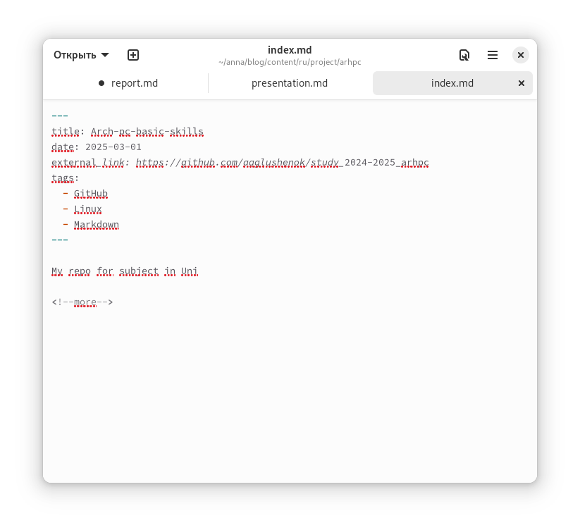
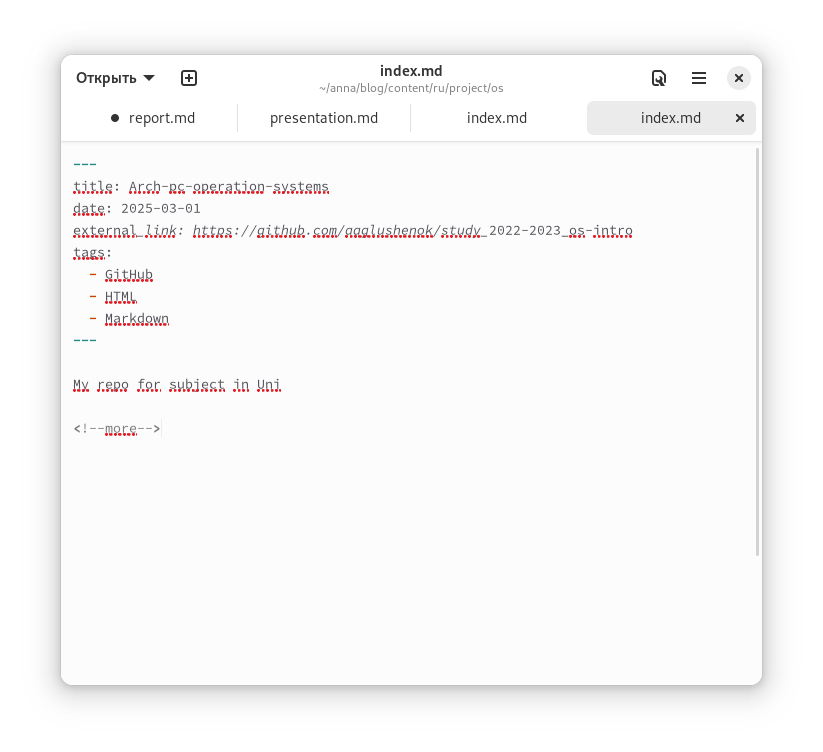

---
## Front matter
lang: ru-RU
title: Этап №5
subtitle: Добавляем остальные элементы на сайт
author:
  - Глушенок А. А.
institute:
  - Российский университет дружбы народов, Москва, Россия
date: 18 марта 2025

## i18n babel
babel-lang: russian
babel-otherlangs: english

## Formatting pdf
toc: false
toc-title: Содержание
slide_level: 2
aspectratio: 169
section-titles: true
theme: metropolis
header-includes:
 - \metroset{progressbar=frametitle,sectionpage=progressbar,numbering=fraction}
 
## Fonts
mainfont: PT Serif
romanfont: PT Serif
sansfont: PT Sans
monofont: PT Mono
mainfontoptions: Ligatures=TeX
romanfontoptions: Ligatures=TeX
sansfontoptions: Ligatures=TeX,Scale=MatchLowercase
monofontoptions: Scale=MatchLowercase,Scale=0.9
---

## Докладчик

:::::::::::::: {.columns align=center}
::: {.column width="70%"}

  * Глушенок Анна Александровна
  * Студент НПИбд-01-24
  * Факультет физико-математических и естественных наук
  * Российский университет дружбы народов
  * [1132246844@pfur.ru](mailto:1132246844@pfur.ru)
  * <https://github.com/aaglushenok/study_2024-2025_arh-pc>

:::
::: {.column width="30%"}

:::
::::::::::::::

## Цель работы

Добавить на сайт записи проектов, пост по прошедшей неделе, добавить пост на тему по языки научного программирования

## Создаем каталоги

В каталоге content - project создаем новые папки

{#fig:001 width=60%}

## Редактирование каталога

В каждой из папок добавляем аватарку проекта и редактируем файл index

{#fig:002 width=60%}

## Редактируем index

Добавляем свой проект

{#fig:003 width=60%}

## Еще один проект

Добавляем свой проект

{#fig:004 width=60%}

## Еще один проект

Добавляем свой проект

{#fig:005 width=60%}

## 4th week

Также делаем пост по прошедшей неделе(4th week):

{#fig:006 width=60%}

## Языки научного программирования

Добавляем пост на тему "Языки научного программирования":

{#fig:007 width=60%}

## Изменения на сайте

Обновляем изменения с помощью hugo server и смотрим на локальном хосте:

{#fig:008 width=60%}

## Выводы

Мы обновили сайт, добавили проекты, сделали пост по прошедшей неделе,добавили пост на тему языки научного программирования

## 
Благодарю за внимание! 
