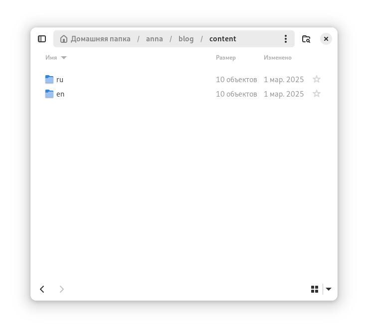
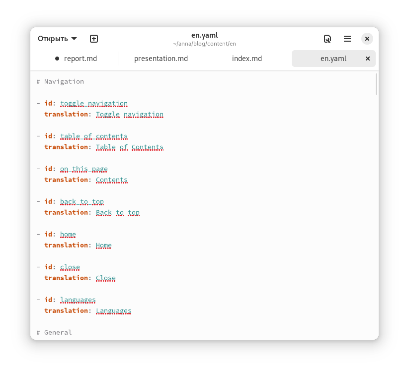
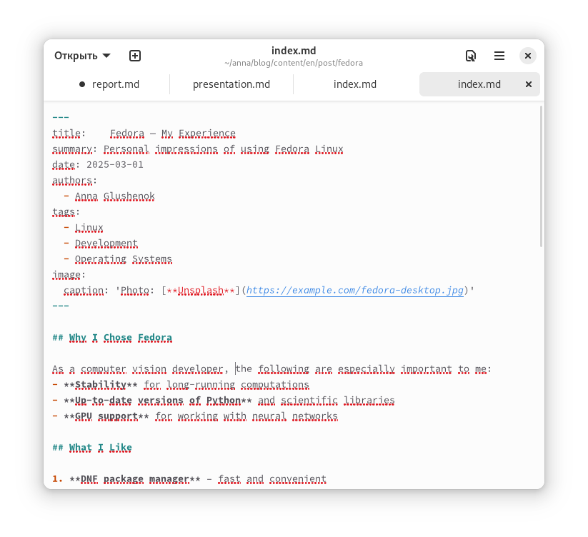
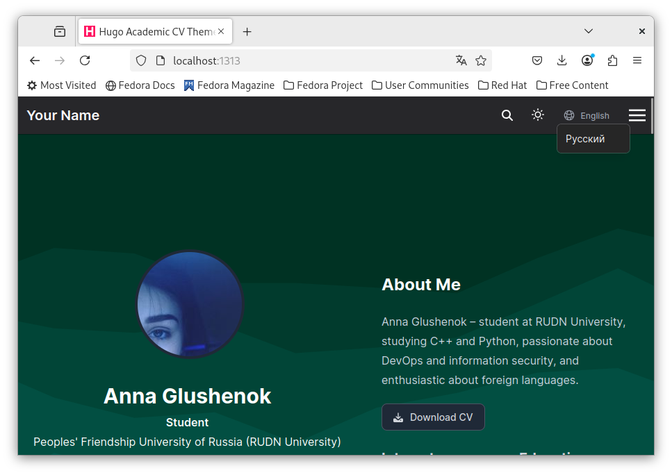

---
## Front matter
lang: ru-RU
title: Этап №6
subtitle: Размещение двуязычного сайта на Github
author:
  - Глушенок А. А.
institute:
  - Российский университет дружбы народов, Москва, Россия
date: 18 марта 2025

## i18n babel
babel-lang: russian
babel-otherlangs: english

## Formatting pdf
toc: false
toc-title: Содержание
slide_level: 2
aspectratio: 169
section-titles: true
theme: metropolis
header-includes:
 - \metroset{progressbar=frametitle,sectionpage=progressbar,numbering=fraction}
 
## Fonts
mainfont: PT Serif
romanfont: PT Serif
sansfont: PT Sans
monofont: PT Mono
mainfontoptions: Ligatures=TeX
romanfontoptions: Ligatures=TeX
sansfontoptions: Ligatures=TeX,Scale=MatchLowercase
monofontoptions: Scale=MatchLowercase,Scale=0.9
---

## Докладчик

:::::::::::::: {.columns align=center}
::: {.column width="70%"}

  * Глушенок Анна Александровна
  * Студент НПИбд-01-24
  * Факультет физико-математических и естественных наук
  * Российский университет дружбы народов
  * [1132246844@pfur.ru](mailto:1132246844@pfur.ru)
  * <https://github.com/aaglushenok/study_2024-2025_arh-pc>

:::
::: {.column width="30%"}

:::
::::::::::::::

## Цель работы

Сделать поддержку английского и русского языков

## Создаем подкаталоги en ru

В каждый копируем то, что раньше было в корне

{#fig:001 width=60%}

## Переводим контент

В контенте en перевести посты и проекты на английский язык

{#fig:002 width=60%}

## Добавление конфигов

Также в каждый из каталогов требуется добавить файл конфига (en/ru).yaml

{#fig:003 width=60%}

## Новый пост на двух языках

Теперь наш сайт поддерживает двуязычность и следующий пост пишется сразу на двух языках:

{#fig:004 width=60%}

## Fedora

Также пишем пост на двух языках на тему fedora:

{#fig:005 width=60%}

## Сайт

Пушим изменения и проверяем работу на хосте:

{#fig:006 width=60%}

## Выводы

Мы обновили сайт, добавили двуязычность, теперь наш сайт поддерживает русский и английские языки!

## 
Благодарю за внимание! 
