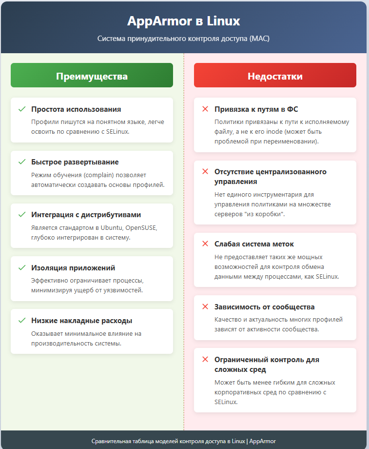

---
## Front matter
lang: ru-RU
title: "Модель управления доступом AppArmor в ОС Linux"
subtitle: Презентация
author:
  - Глушенок А. А.
institute:
  - Российский университет дружбы народов, Москва, Россия
date: 14 сентября 2025

## i18n babel
babel-lang: russian
babel-otherlangs: english

## Formatting pdf
toc: false
toc-title: Содержание
slide_level: 2
aspectratio: 169
section-titles: true
theme: metropolis
header-includes:
 - \metroset{progressbar=frametitle,sectionpage=progressbar,numbering=fraction}
 
## Fonts
mainfont: PT Serif
romanfont: PT Serif
sansfont: PT Sans
monofont: PT Mono
mainfontoptions: Ligatures=TeX
romanfontoptions: Ligatures=TeX
sansfontoptions: Ligatures=TeX,Scale=MatchLowercase
monofontoptions: Scale=MatchLowercase,Scale=0.9
---

## Докладчик

:::::::::::::: {.columns align=center}
::: {.column width="70%"}

  * Глушенок Анна Александровна
  * Студент НПИбд-01-24
  * Факультет физико-математических и естественных наук
  * Российский университет дружбы народов
  * [1132246844@pfur.ru](mailto:1132246844@pfur.ru)
  * <https://github.com/aaglushenok>

:::
::: {.column width="30%"}

:::
::::::::::::::

## Введение

1.  **Тема:** «Модель управления доступом AppArmor в ОС Linux».

2.  **Актуальность:** В современном мире, где киберугрозы становятся все более изощренными, критически важной задачей является обеспечение безопасности информационных систем. Стандартных моделей разграничения прав в операционных системах часто бывает недостаточно. AppArmor представляет собой одну из ключевых технологий принудительного контроля доступа (MAC), которая позволяет эффективно ограничивать потенциальный ущерб от уязвимостей в программном обеспечении, что делает ее крайне актуальной для серверов, рабочих станций и контейнерных сред.

## Введение

3.  **Объект исследования:** Система управления доступом в операционных системах семейства Linux.
4.  **Предмет исследования:** Модель принудительного контроля доступа AppArmor, ее архитектура, компоненты и практическое применение.
5.  **Цель:** Изучить модель управления доступом AppArmor, ее особенности, архитектуру и место в экосистеме безопасности Linux.
6.  **Задачи:**
- Исследовать базовые модели управления доступом в Linux (DAC и MAC).
- Определить место AppArmor в системе безопасности Linux.
- Проанализировать ключевые компоненты, принципы работы и профили AppArmor.
- Провести сравнительный анализ AppArmor и SELinux.
- Оценить современную значимость и области применения AppArmor.

## Управление доступом в ОС Linux

## Модели управления доступом в ОС Linux

В Linux исторически существует две основные модели управления доступом:

- **DAC (Discretionary Access Control — Избирательное Управление Доступом):** Это гибкая и распространенная модель, основанная на правах пользователей и групп (права "rwx", где r - read (чтение), w - write (запись), x - execute (выполнение)). Её особенность — децентрализация: владелец файла или процесса может изменять эти права для других. Это делает DAC простой в использовании, но создаёт главный недостаток — проблему эскалации привилегий.

## Модели управления доступом в ОС Linux

- **MAC (Mandatory Access Control — Принудительное Управление Доступом):** Эта модель реализует централизованный и строгий подход. Права доступа определяются глобальной политикой безопасности, установленной администратором, а не волей владельца объекта. Каждому субъекту и объекту присваиваются метки безопасности (например, классификации: «Конфиденциально», «Секретно»). Пользователь не может изменить эти правила, даже если является владельцем. Цель MAC — жёстко ограничить возможности пользователей и процессов заданными рамками, эффективно изолируя процессы и минимизируя ущерб от взломов и вредоносного ПО.

*Вывод:* В ОС Linux существует две основные модели управления доступом - DAC и MAC. DAC предлагает простоту и гибкость, а MAC — максимальную безопасность ценой сложности администрирования.

## SELinux и AppArmor как реализации модели MAC

- **SELinux (Security-Enhanced Linux)** — это реализация принудительного контроля доступа (MAC) в Linux, первоначально разработанная Агентством национальной безопасности США. Она использует систему меток для всех системных объектов и строгие политики, основанные на правилах взаимодействия между этими метками.
- **AppArmor (Application Armor)** — это система принудительного контроля доступа (MAC) для Linux, которая использует профили, привязанные к пути исполняемого файла. Профили определяют разрешения для файлов, сетевых соединений и возможностей конкретного приложения.

## SELinux и AppArmor как реализации модели MAC

Оба инструмента являются основными практическими реализациями модели (MAC) в Linux, но используют принципиально разные подходы. Оба решения предотвращают несанкционированный доступ, даже если злоумышленник получит права root.

*Вывод:* SELinux и AppArmor — две основные реализации модели принудительного контроля доступа (MAC) в Linux, фундаментально отличающиеся подходом, но преследующие общую цель повышения безопасности системы.

## Схема управления доступом в Linux

Наглядно место AppArmor в общей системе управления доступом в Linux можно представить следующей схемой:

{#fig:001 width=100%}

Важно отметить, что схема включает в себя только рассматриваемые модели и их элементы.

## Ключевые компоненты и особенности AppArmor

## Ключевая идея модели AppArmor

AppArmor — это система принудительного контроля доступа в Linux, работающая на уровне приложений. Её ключевая идея — профилирование приложений. В отличие от таких моделей, как SELinux, которые метят все системные объекты, AppArmor привязывает профиль безопасности непосредственно к исполняемому файлу программы.
Этот профиль представляет собой перечень разрешённых операций (whitelist). Еще одна ключевая идея AppArmor - максимально ограничить приложение, предоставив ему лишь минимальный набор прав, необходимый для работы. Это значительно снижает ущерб от уязвимостей: если злоумышленник взломает программу, он не сможет выйти за рамки её профиля.

*Вывод:* Ключевая идея AppArmor - защита Linux через профили приложений и предоставление им минимальных необходимых прав. Это ограничивает ущерб от взлома, изолируя программу в рамках её разрешений.

## Особенности и принципы работы модели AppArmor

- **Путевая модель (Path-based).** В отличие от моделей, использующих сложные метки безопасности, AppArmor определяет правила доступа с помощью знакомых абсолютных путей к файловой системе. Это делает профили более простыми для чтения и написания.
- **Привязка к имени исполняемого файла.** Профиль безопасности неразрывно связан с конкретным путем к исполняемому файлу приложения. Механизм контроля активируется автоматически при запуске программы, чей путь совпадает с путем, указанным в конфигурации профиля. Это обеспечивает прозрачность и простоту управления.

## Особенности и принципы работы модели AppArmor

- **Глубокая интеграция с ядром Linux.** AppArmor реализован в виде модуля безопасности ядра. Это означает, что он работает на самом низком уровне операционной системы. Модуль перехватывает все системные вызовы, которые защищаемое приложение пытается выполнить, и проверяет их на соответствие правилам, описанным в профиле. Эта проверка происходит до фактического выполнения вызова, что гарантирует блокировку любых неавторизованных действий.

*Вывод:* Сочетание этих трех принципов работы делает AppArmor мощным, но при этом относительно простым в использовании и администрировании инструментом для изоляции приложений и минимизации ущерба от потенциальных уязвимостей.

## Профили AppArmor и режимы работы

Профили AppArmor представляют собой текстовые конфигурационные файлы, расположенные в директории `/etc/apparmor.d/`. Каждый файл содержит набор правил, определяющих разрешения для конкретного приложения. Ключевой особенностью работы системы является использование двух режимов, между которыми можно динамически переключаться:

- **Enforce-режим (режим принуждения)**: Это рабочий режим обеспечения безопасности. В этом режиме политика безопасности активно применяется: ядро полностью блокирует все действия приложения, выходящие за рамки разрешённых правил профиля. Каждая попытка нарушения не только пресекается, но и детально логируется (записывается) в системный журнал (например, `/var/log/syslog` или `/var/log/audit/audit.log`), что позволяет администратору отслеживать попытки несанкционированного доступа.

## Профили AppArmor и режимы работы

- **Complain-режим (режим обучения или отладки)**: Этот режим предназначен для создания и настройки новых профилей. В нём AppArmor не блокирует никакие действия приложения. Вместо этого система пассивно отслеживает его работу и записывает в лог (журнал) все события, которые были бы запрещены в enforce-режиме. Этот лог нарушений является основным источником информации для разработчика профиля, позволяя ему постепенно дополнять правила, пока приложение не начнёт работать без ошибок, после чего профиль можно перевести в полноценный enforce-режим.

*Вывод:* Два режима работы профилей в AppArmor обеспечивают не только мощную защиту, но и гибкий, итеративный процесс разработки политик безопасности.

## Преимущества и недостатки модели AppArmor

{#fig:002 width=60%}

## Преимущества и недостатки модели AppArmor

Модель безопасности AppArmor демонстрирует выраженную ориентированность на практичность и удобство использования. Её ключевое преимущество заключается в низком пороге вхождения — система использует понятные текстовые профили, что значительно упрощает процесс создания и модификации политик безопасности даже для администраторов средней квалификации. Низкие накладные расходы на производительность делают AppArmor привлекательным решением для сред, где важна минимальная нагрузка на систему.

## Преимущества и недостатки модели AppArmor

Однако эта простота имеет обратную сторону. Зависимость от путей файловой системы создает потенциальные уязвимости — злоумышленник может попытаться обойти защиту через симлинки или жесткие ссылки. Ограниченная гранулярность контроля не позволяет реализовать сложные сценарии безопасности, доступные в SELinux. Отсутствие поддержки многоуровневой безопасности (MLS) делает AppArmor менее пригодным для сред со строгими требованиями соответствия.

*Вывод:* AppArmor идеален для быстрого развертывания базовой защиты благодаря простоте настройки, но уступает в гибкости и глубине контроля более сложным системам.

## Сравнение AppArmor и SELinux

Для начала наглядно посмотрим на взаимосвязь и различие модели DAC и модели MAC (представленной на примере AppArmor и SELinux):

{#fig:003 width=60%}

Эта схема показывает иерархию и основные характеристики моделей управления доступом в Linux, помогая понять их взаимосвязь и отличительные особенности.

## Сравнение AppArmor и SELinux

{#fig:004 width=50%}

## Сравнение AppArmor и SELinux

Обобщим данные сравнения:

**AppArmor**

- Простота: Легче изучать и настраивать
- Профили: Создаются для конкретных приложений
- Подход: "Что разрешено приложению" (whitelist)
- Идеален для: Веб-серверов и изоляции отдельных служб

**SELinux**

- Безопасность: Более строгая и комплексная
- Гранулярность: Детальный контроль над всеми объектами
- Подход: "Что запрещено по умолчанию" (default-deny)
- Идеален для: Высокозащищенных сред и многопользовательских систем

## Сравнение AppArmor и SELinux

**Рекомендации по выбору**

*AppArmor лучше подходит для:*

- Начинающих администраторов
- Быстрой изоляции конкретных приложений
- Систем с предсказуемой файловой структурой
- Сред с ограниченными ресурсами

*SELinux предпочтительнее для:*

- Критически важных систем
- Сред со строгими требованиями безопасности
- Комплексных политик доступа
- Многопользовательских окружений

## AppArmor и современный мир

## Современная значимость AppArmor

AppArmor остается чрезвычайно значимой технологией. Его простота сделала его де-факто стандартом для:

- Дистрибутивов на базе Debian/Ubuntu: Является системой MAC по умолчанию.
- Контейнеризации: Интегрирован с Docker и LXC/LXD для изоляции контейнеров.
- Snap-пакетов: Технология контейнеризации приложений Snap от Canonical использует строгие AppArmor-профили для изоляции каждого пакета от основной системы и друг от друга.
- Облачных сред: Широко используется в облачных инфраструктурах для изоляции рабочих нагрузок.

## Современная значимость AppArmor

Присутствие AppArmor по умолчанию во всех установках Ubuntu Server и Desktop говорит о его широчайшем распространении.

*Вывод:* AppArmor сохраняет ключевую роль как стандарт безопасности в Ubuntu, контейнерах и Snap-пакетах, обеспечивая базовую защиту миллионов систем благодаря простоте и интеграции по умолчанию.

## Примеры использования AppArmor в индустрии

- **Canonical** (разработчик Ubuntu): Интегрирует и активно развивает AppArmor как основную технологию MAC для своей ОС.
- **Microsoft**: Использует AppArmor в подсистеме Windows Subsystem for Linux для изоляции Linux-окружения от хостовой Windows-системы.
- **SUSE / OpenSUSE**: Продолжают поддерживать и поставлять AppArmor в своих дистрибутивах.
- **Google**: Использует в компонентах инфраструктуры и облачных сервисов.
- **Множество хостинг-провайдеров и DevOps-команд**: Используют AppArmor для простого и эффективного «запечатывания» сервисов, чтобы минимизировать последствия потенциального взлома.

*Вывод:* AppArmor доказал свою практическую ценность, будучи внедренным в продуктах ведущих IT-компаний и используемым для защиты критической инфраструктуры по всему миру.

## Заключение

1.  AppArmor является мощной и современной реализацией модели MAC в Linux, альтернативной SELinux.
2.  Ключевое преимущество AppArmor — его простота, основанная на путевой модели и профилировании приложений, что значительно снижает порог входа для системных администраторов.
3.  AppArmor эффективно решает задачу минимизации ущерба от уязвимостей в ПО путем ограничения возможностей приложений строго заданными правилами на основе принципа минимальных привилегий.
4.  Несмотря на меньшую, по сравнению с SELinux, гранулярность в некоторых сценариях, AppArmor идеально подходит для защиты серверных приложений, веб-сервисов и для изоляции контейнеров.
5.  Благодаря глубокой интеграции в Ubuntu и поддержке со стороны крупных игроков, экосистемы контейнеризации, AppArmor остается чрезвычайно актуальным и широко используемым инструментом в современном мире Linux, обеспечивая базовый уровень безопасности для миллионов систем по всему миру.

## Благодарю за внимание!
