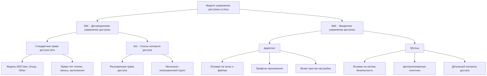
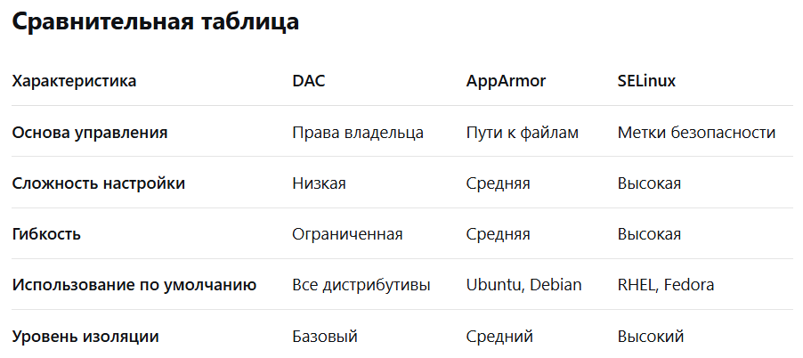
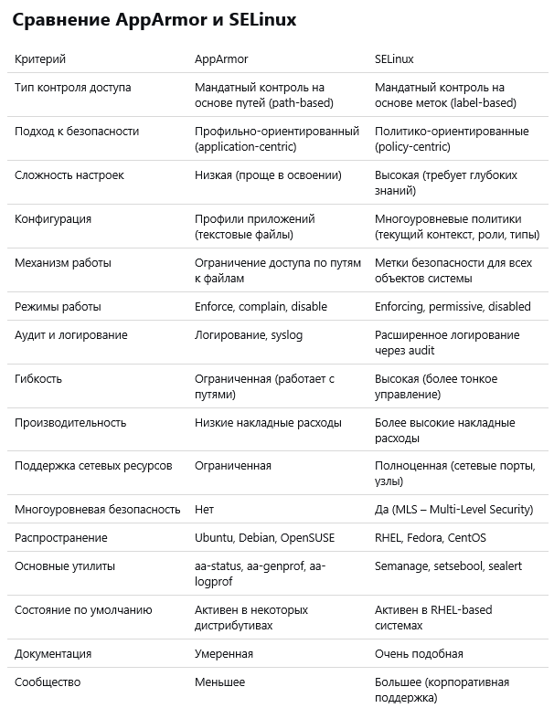

---
## Front matter
title: "Модель управления доступом AppArmor в ОС Linux"
subtitle: "Доклад"
author: "Анна Александровна Глушенок"

## Generic otions
lang: ru-RU
toc-title: "Содержание"

## Bibliography
bibliography: bib/cite.bib
csl: pandoc/csl/gost-r-7-0-5-2008-numeric.csl

## Pdf output format
toc: true # Table of contents
toc-depth: 2
lof: true # List of figures
lot: true # List of tables
fontsize: 12pt
linestretch: 1.5
papersize: a4
documentclass: scrreprt
## I18n polyglossia
polyglossia-lang:
  name: russian
  options:
	- spelling=modern
	- babelshorthands=true
polyglossia-otherlangs:
  name: english
## I18n babel
babel-lang: russian
babel-otherlangs: english
## Fonts
mainfont: IBM Plex Serif
romanfont: IBM Plex Serif
sansfont: IBM Plex Sans
monofont: IBM Plex Mono
mathfont: STIX Two Math
mainfontoptions: Ligatures=Common,Ligatures=TeX,Scale=0.94
romanfontoptions: Ligatures=Common,Ligatures=TeX,Scale=0.94
sansfontoptions: Ligatures=Common,Ligatures=TeX,Scale=MatchLowercase,Scale=0.94
monofontoptions: Scale=MatchLowercase,Scale=0.94,FakeStretch=0.9
mathfontoptions:
## Biblatex
biblatex: true
biblio-style: "gost-numeric"
biblatexoptions:
  - parentracker=true
  - backend=biber
  - hyperref=auto
  - language=auto
  - autolang=other*
  - citestyle=gost-numeric
## Pandoc-crossref LaTeX customization
figureTitle: "Рис."
tableTitle: "Таблица"
listingTitle: "Листинг"
lofTitle: "Список иллюстраций"
lotTitle: "Список таблиц"
lolTitle: "Листинги"
## Misc options
indent: true
header-includes:
  - \usepackage{indentfirst}
  - \usepackage{float} # keep figures where there are in the text
  - \floatplacement{figure}{H} # keep figures where there are in the text
---

# Введение

1.  **Тема:** «Модель управления доступом AppArmor в ОС Linux».
2.  **Актуальность:** В современном мире, где киберугрозы становятся все более изощренными, критически важной задачей является обеспечение безопасности информационных систем. Стандартных моделей разграничения прав в операционных системах часто бывает недостаточно. AppArmor представляет собой одну из ключевых технологий принудительного контроля доступа (MAC), которая позволяет эффективно ограничивать потенциальный ущерб от уязвимостей в программном обеспечении, что делает ее крайне актуальной для серверов, рабочих станций и контейнерных сред.
3.  **Объект исследования:** Система управления доступом в операционных системах семейства Linux.
4.  **Предмет исследования:** Модель принудительного контроля доступа AppArmor, ее архитектура, компоненты и практическое применение.
5.  **Научная новизна:** Работа заключается в систематизации и сравнительном анализе современных реализаций систем MAC (Mandatory Access Control) в Linux, с фокусом на практические аспекты внедрения и использования AppArmor в отличие от более сложного SELinux.
6.  **Практическая значимость работы:** Результаты исследования могут быть использованы системными администраторами и DevOps-инженерами для выбора и реализации эффективной стратегии безопасности на основе AppArmor, позволяющей снизить поверхность атаки приложений с минимальными затратами на внедрение и поддержку.
7.  **Цель:** Изучить модель управления доступом AppArmor, ее особенности, архитектуру и место в экосистеме безопасности Linux.
8.  **Задачи:**
- Исследовать базовые модели управления доступом в Linux (DAC и MAC).
- Определить место AppArmor в системе безопасности Linux.
- Проанализировать ключевые компоненты, принципы работы и профили AppArmor.
- Провести сравнительный анализ AppArmor и SELinux.
- Оценить современную значимость и области применения AppArmor.

# Основная часть

## Управление доступом в ОС Linux

### Модели управления доступом в ОС Linux

В Linux исторически существует две основные модели управления доступом:

- **DAC (Discretionary Access Control — Избирательное Управление Доступом):** Это гибкая и распространенная модель, основанная на правах пользователей и групп (права "rwx", где r - read (чтение), w - write (запись), x - execute (выполнение); для user/group/other). Её ключевая особенность — <u>децентрализация</u>: владелец файла или процесса может по своему усмотрению изменять эти права для других. Это делает DAC простой в использовании, но создаёт главный недостаток — проблему <u>эскалации привилегий</u>. Если злоумышленник получит права пользователя, он сможет получить доступ ко всем ресурсам, доступным этому пользователю, включая те, которые были ошибочно открыты владельцем.
- **MAC (Mandatory Access Control — Принудительное Управление Доступом):** Эта модель реализует централизованный и строгий подход. Права доступа определяются <u>глобальной политикой безопасности</u>, установленной администратором, а не волей владельца объекта. Каждому субъекту (пользователю или процессу) и объекту (файлу, сокету) присваиваются <u>метки безопасности</u> (например, уровни классификации: «Конфиденциально», «Секретно»). Пользователь не может изменить эти правила, даже если является владельцем. Цель MAC — жёстко ограничить возможности пользователей и процессов заданными рамками, эффективно <u>изолируя процессы</u> и минимизируя ущерб от взломов и вредоносного ПО.

*Вывод:* В ОС Linux существует две основные модели управления доступом - DAC и MAC. DAC предлагает простоту и гибкость, а MAC — <u>максимальную безопасность</u> ценой сложности администрирования.

### SELinux и AppArmor как реализации модели MAC

- **SELinux (Security-Enhanced Linux)** — это реализация принудительного контроля доступа (MAC) в Linux, первоначально разработанная Агентством национальной безопасности США (NSA). Она использует систему <u>меток</u> (безопасных контекстов) для всех системных объектов и строгие политики, основанные на правилах взаимодействия между этими метками.

- **AppArmor (Application Armor)** — это система принудительного контроля доступа (MAC) для Linux, которая использует <u>профили</u>, привязанные к пути исполняемого файла приложения. Профили определяют разрешения для файлов, сетевых соединений и возможностей (capabilities) конкретного приложения.

Оба инструмента являются основными практическими реализациями модели принудительного контроля доступа (MAC) в Linux, но используют принципиально разные подходы. Оба решения предотвращают <u>несанкционированный доступ</u>, даже если злоумышленник получит права root, что является ключевой характеристикой принудительного контроля доступа.

*Вывод:* SELinux и AppArmor — две основные реализации модели принудительного контроля доступа (MAC) в Linux, фундаментально отличающиеся подходом, но преследующие общую цель <u>повышения безопасности системы</u>.

### Схема управления доступом в Linux

Наглядно место AppArmor в общей системе управления доступом в Linux можно представить следующей схемой:

{#fig:001 width=80%}

Важно отметить, что схема включает в себя только рассматриваемые модели и их элементы.

## Ключевые компоненты и особенности AppArmor

### Ключевая идея модели AppArmor

AppArmor — это система принудительного контроля доступа в Linux, работающая на уровне приложений. Её ключевая идея — <u>профилирование приложений</u>. В отличие от таких моделей, как SELinux, которые метят все системные объекты, AppArmor привязывает профиль безопасности непосредственно к исполняемому файлу программы.

Этот профиль представляет собой перечень разрешённых операций (<u>whitelist</u>), таких как доступ к файлам, сетевым соединениям, библиотекам и другим ресурсам. Еще одна ключевая идея AppArmor - максимально ограничить приложение, предоставив ему лишь <u>минимальный набор прав</u>, необходимый для работы (принцип минимальных привилегий). Другими словами, работу модели можно описать так: «что разрешено, то и можно делать». Это значительно снижает ущерб от уязвимостей: если злоумышленник взломает программу, он не сможет выйти за рамки её профиля.

*Вывод:* Ключевая идея AppArmor - защита Linux через <u>профили приложений</u> и предоставление им минимальных необходимых прав. Это ограничивает ущерб от взлома, <u>изолируя программу</u> в рамках её разрешений.

### Особенности и принципы работы модели AppArmor

- **Путевая модель (Path-based).** В отличие от моделей, использующих сложные метки безопасности, AppArmor определяет правила доступа с помощью знакомых <u>абсолютных путей</u> к файловой системе. Это делает профили более простыми для чтения и написания. Например, правило `/etc/nginx/nginx.conf r` разрешает только чтение данного файла, а `/var/log/nginx/* rw` — чтение и запись для всех файлов в этой директории.

- **Привязка к имени исполняемого файла.** Профиль безопасности неразрывно связан с конкретным путем к исполняемому файлу приложения (например, `/usr/sbin/nginx`). Механизм контроля активируется автоматически при запуске программы, чей путь совпадает с путем, указанным в конфигурации профиля. Это обеспечивает <u>прозрачность</u> и простоту управления.

- **Глубокая интеграция с ядром Linux.** AppArmor реализован в виде <u>модуля безопасности ядра</u> (Linux Security Module - LSM). Это означает, что он работает на самом низком уровне операционной системы. Модуль перехватывает все системные вызовы, которые защищаемое приложение пытается выполнить (открытие файла, работа с сетью и т.д.), и проверяет их на соответствие правилам, описанным в профиле. Эта проверка происходит до фактического выполнения вызова, что гарантирует <u>блокировку</u> любых неавторизованных действий.

*Вывод:* Сочетание этих трех принципов работы делает AppArmor мощным, но при этом относительно простым в использовании и администрировании инструментом для <u>изоляции приложений</u> и минимизации ущерба от потенциальных уязвимостей.

### Профили AppArmor и режимы работы

Профили AppArmor представляют собой текстовые конфигурационные файлы, расположенные в директории `/etc/apparmor.d/`. Каждый файл содержит набор правил, определяющих разрешения для конкретного приложения. Ключевой особенностью работы системы является использование двух режимов, между которыми можно динамически переключаться:

- **Enforce-режим (режим принуждения)**: Это рабочий режим обеспечения безопасности. В этом режиме политика безопасности активно применяется: ядро полностью блокирует все действия приложения, выходящие за рамки разрешённых правил профиля. Каждая попытка нарушения не только пресекается, но и детально <u>логируется</u> (записывается) в системный журнал (например, `/var/log/syslog` или `/var/log/audit/audit.log`), что позволяет администратору отслеживать попытки несанкционированного доступа.

- **Complain-режим (режим обучения или отладки)**: Этот режим предназначен для создания и настройки новых профилей. В нём AppArmor не блокирует никакие действия приложения. Вместо этого система пассивно отслеживает его работу и записывает в лог (журнал) все события, которые были бы запрещены в enforce-режиме. Этот лог нарушений является основным источником информации для разработчика профиля, позволяя ему постепенно дополнять правила, пока приложение не начнёт работать без ошибок, после чего профиль можно перевести в полноценный enforce-режим.

*Вывод:* Два режима работы профилей в AppArmor обеспечивают не только мощную защиту, но и <u>гибкий</u>, итеративный процесс__ разработки политик безопасности.

### Преимущества и недостатки модели AppArmor

Наглядно преимущества и недостатки AppArmor можно представить следующей таблицей:

{#fig:002 width=80%}

Модель безопасности AppArmor демонстрирует выраженную ориентированность на практичность и удобство использования. Её ключевое преимущество заключается в <u>низком пороге вхождения</u> — система использует понятные текстовые профили, что значительно упрощает процесс создания и модификации политик безопасности даже для администраторов средней квалификации. Низкие накладные расходы на производительность делают AppArmor привлекательным решением для production-сред, где важна минимальная нагрузка на систему.

Однако эта простота имеет обратную сторону. Зависимость от путей файловой системы создает потенциальные уязвимости — злоумышленник может попытаться обойти защиту через симлинки или жесткие ссылки. Ограниченная гранулярность контроля не позволяет реализовать сложные сценарии безопасности, доступные в SELinux. Отсутствие поддержки многоуровневой безопасности (MLS) делает AppArmor менее пригодным для сред со строгими требованиями соответствия (compliance).

*Вывод:* AppArmor идеален для быстрого развертывания базовой защиты благодаря <u>простоте настройки</u>, но уступает в гибкости и глубине контроля более сложным системам.

### Сравнение AppArmor и SELinux

Для начала наглядно посмотрим на взаимосвязь и различие модели DAC и модели MAC (представленной на примере AppArmor и SELinux):

{#fig:003 width=80%}

Эта схема показывает иерархию и основные характеристики моделей управления доступом в Linux, помогая понять их взаимосвязь и отличительные особенности.

Далее подробно рассмотрим и сравним AppArmor и SELinux, представим результаты следующей таблицей:

{#fig:004 width=80%}

Обобщим данные сравнения:

**AppArmor**
- Простота: Легче изучать и настраивать
- Профили: Создаются для конкретных приложений
- Подход: "Что разрешено приложению" (whitelist)
- Идеален для: Веб-серверов и изоляции отдельных служб

**SELinux**
- Безопасность: Более строгая и комплексная
- Гранулярность: Детальный контроль над всеми объектами
- Подход: "Что запрещено по умолчанию" (default-deny)
- Идеален для: Высокозащищенных сред и многопользовательских систем

**Рекомендации по выбору**

*AppArmor лучше подходит для:*
- Начинающих администраторов
- Быстрой изоляции конкретных приложений
- Систем с предсказуемой файловой структурой
- Сред с ограниченными ресурсами

*SELinux предпочтительнее для:*
- Критически важных систем
- Сред со строгими требованиями безопасности
- Комплексных политик доступа
- Многопользовательских окружений

## AppArmor и современный мир

### Современная значимость AppArmor

AppArmor остается чрезвычайно значимой технологией. Его простота сделала его <u>де-факто стандартом</u> для:

- Дистрибутивов на базе Debian/Ubuntu: Является системой MAC по умолчанию.
- Контейнеризации: Интегрирован с Docker и LXC/LXD для изоляции контейнеров. Например, Docker может автоматически генерировать AppArmor-профили для контейнеров.
- Snap-пакетов: Технология контейнеризации приложений Snap от Canonical использует строгие AppArmor-профили для изоляции каждого пакета от основной системы и друг от друга.
- Облачных сред: Широко используется в облачных инфраструктурах для изоляции рабочих нагрузок.

Точной общедоступной статистики по использованию нет, но его присутствие по умолчанию во всех установках Ubuntu Server и Desktop (одном из самых популярных дистрибутивов) говорит о его <u>широчайшем распространении</u>.

*Вывод:* AppArmor сохраняет ключевую роль как <u>стандарт безопасности</u> в Ubuntu, контейнерах и Snap-пакетах, обеспечивая базовую защиту миллионов систем благодаря простоте и интеграции по умолчанию.

### Примеры использования AppArmor в индустрии

- **Canonical** (разработчик Ubuntu): Интегрирует и активно развивает AppArmor как основную технологию MAC для своей ОС.
- **Microsoft**: Использует AppArmor в подсистеме Windows Subsystem for Linux (WSL 2) для изоляции Linux-окружения от хостовой Windows-системы.
- **SUSE / OpenSUSE**: Продолжают поддерживать и поставлять AppArmor в своих дистрибутивах.
- **Google**: Использует в некоторых компонентах своей инфраструктуры и облачных сервисов.
- **Множество хостинг-провайдеров и DevOps-команд**: Используют AppArmor для простого и эффективного «запечатывания» таких сервисов, как Nginx, MySQL, Redis, чтобы минимизировать последствия потенциального взлома.

*Вывод:* AppArmor доказал свою <u>практическую ценность</u>, будучи внедренным в продуктах ведущих IT-компаний и используемым для защиты критической инфраструктуры по всему миру.

# Заключение

1.  AppArmor является мощной и современной реализацией модели принудительного контроля доступа (MAC) в Linux, альтернативной SELinux.
2.  Ключевое преимущество AppArmor — его простота, основанная на путевой модели и профилировании приложений, что значительно снижает порог входа для системных администраторов.
3.  AppArmor эффективно решает задачу минимизации ущерба от уязвимостей в программном обеспечении путем ограничения возможностей приложений строго заданными правилами на основе принципа минимальных привилегий.
4.  Несмотря на меньшую, по сравнению с SELinux, гранулярность в некоторых сценариях, AppArmor идеально подходит для защиты серверных приложений, веб-сервисов и для изоляции контейнеров.
5.  Благодаря глубокой интеграции в Ubuntu и поддержке со стороны крупных игроков (Canonical, Microsoft), экосистемы контейнеризации (Docker, LXC, Snap), AppArmor остается чрезвычайно актуальным и широко используемым инструментом в современном мире Linux, обеспечивая базовый уровень безопасности для миллионов систем по всему миру.

# Список литературы 

1. Бумажные ресурсы:
- Немет Э., Снайдер Г., Хейн Т., Уэйли Б. UNIX и Linux: Руководство системного администратора. — 4-е изд. — Пер. с англ. — СПб.: БХВ-Петербург, 2018. — 1312 с.
- Гафнер В.В. Информационная безопасность: учебное пособие. — М.: ИНФРА-М, 2018. — 336 с.
- Колисниченко Д.Н. Linux. От новичка к профессионалу. — СПб.: БХВ-Петербург, 2019. — 848 с.
- Робачевский А.М. Операционная система UNIX. — СПб.: БХВ-Петербург, 2017. — 656 с.

2. Электронные ресурсы:
- Официальная документация AppArmor: [https://gitlab.com/apparmor/apparmor/-/wikis/home](https://gitlab.com/apparmor/apparmor/-/wikis/home)
- Ubuntu Documentation: AppArmor: [https://ubuntu.com/server/docs/security-apparmor](https://ubuntu.com/server/docs/security-apparmor)
- Linux Kernel Documentation: AppArmor: [https://www.kernel.org/doc/html/latest/admin-guide/LSM/apparmor.html](https://www.kernel.org/doc/html/latest/admin-guide/LSM/apparmor.html)
- Linux Man Pages: `apparmor(7)`, `apparmor.d(5)`, `aa-status(8)`, `aa-genprof(8)`
- DigitalOcean: "An Introduction to AppArmor in Ubuntu 20.04": [https://www.digitalocean.com/community/tutorials/an-introduction-to-apparmor-in-ubuntu-20-04](https://www.digitalocean.com/community/tutorials/an-introduction-to-apparmor-in-ubuntu-20-04)
- Red Hat: "Understanding and using AppArmor": [https://www.redhat.com/sysadmin/apparmor](https://www.redhat.com/sysadmin/apparmor)
- SUSE Documentation: "AppArmor Administration Guide": [https://documentation.suse.com/sles/15-SP4/html/SLES-all/sec-apparmor-admin.html](https://documentation.suse.com/sles/15-SP4/html/SLES-all/sec-apparmor-admin.html)
- Docker Documentation: "AppArmor security profiles for Docker": [https://docs.docker.com/engine/security/apparmor/](https://docs.docker.com/engine/security/apparmor/)
- Debian Wiki: AppArmor: [https://wiki.debian.org/AppArmor](https://wiki.debian.org/AppArmor)
- Microsoft Documentation: "AppArmor in WSL 2": [https://docs.microsoft.com/en-us/windows/wsl/security#apparmor](https://docs.microsoft.com/en-us/windows/wsl/security#apparmor)

